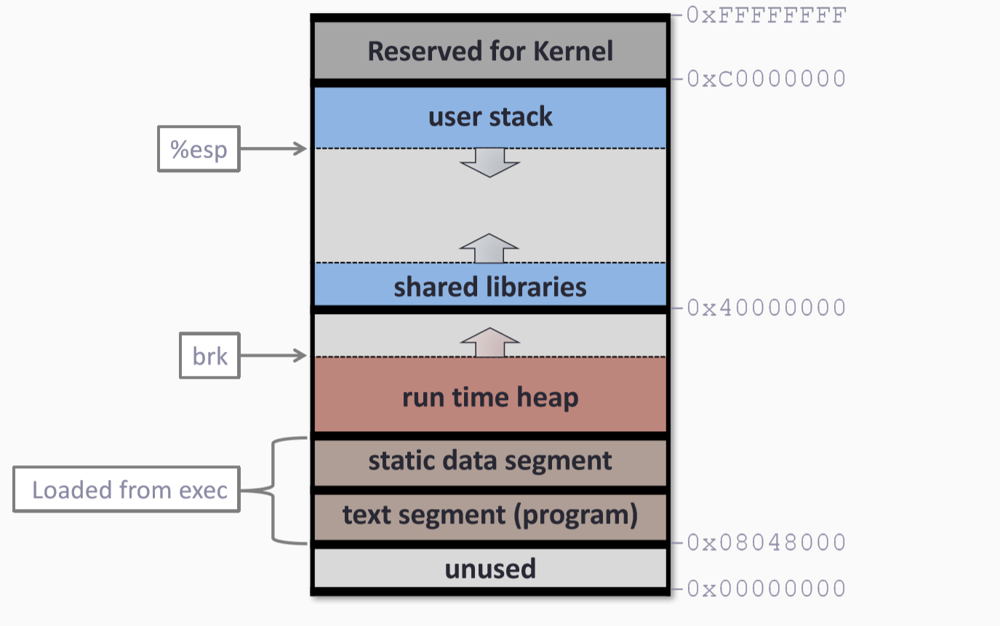
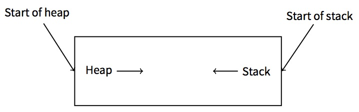
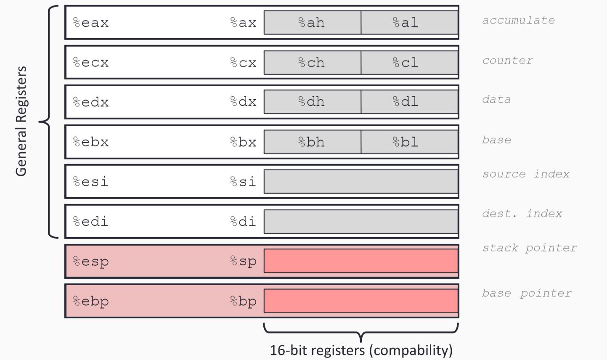
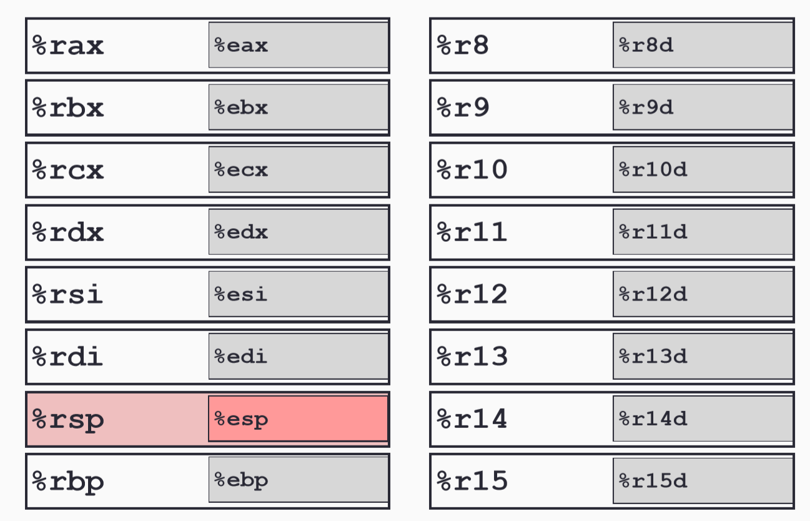

---
presentation:
  width: 1600
  height: 900
  slideNumber: 'c/t'
  showSlideNumber: "all"
  center: true
  enableSpeakerNotes: true
  theme: none.css
---


<!-- slide data-notes="" -->
# 背景知识

<!-- slide data-notes="" -->
## 汇编基础（x86）
- 内存
- 寄存器：
  1. 普通:       EAX, EBX, ECX, EDX 
               ESI, EDI, EBP, ESP  
  2. 段寄存器:    CS, DS, ES, FS, GS, SS 
  3. 特殊寄存器:  EIP , EFLAGS
- 指令
  1. push,pop
  2. add/sub/mul/div, xor, or 
  3. mov, lea, 
  4.  test, cmp, jmp, call, <font color=red>ret</font>
<!-- slide data-notes="" -->
## 内存
### 物理内存尺寸
4GB (2^32) for x86, 2^64 bytes for x64
### 内存中有什么
- 可执行文件本身（代码+静态数据）
- 相关库（代码+静态数据）
- 运行时数据
  - heap
  - stack
- 操作系统的代码和数据
<!-- slide data-notes="" -->
## Linux进程内存布局（32位）

<!-- slide data-notes="" -->
## 栈 Stack
### 栈：一种数据结构
- 先进后出
- PUSH，POP
### 函数调用栈
- 局部变量在函数结束后销毁
- 每一个函数有一段在栈上的框架（栈帧）来保存它的数据（局部变量。。）
### 为什么使用栈？
- 维护函数调用关系

<!-- slide data-notes="" -->
## tips：为什么栈会反向增长

显然地，我们的习惯上比较接受的是从低地址向高地址增长的数据。
栈的反向增长令人困惑，但回溯历史便可以发现原因。早年计算内存空间很小，计算机需要同时在内存上维护栈和堆两个数据结构时，因为不好估计栈和堆的大小，最省事的方式就是把两个数据结构放在内存的两端，同时向中间增长，而栈一般就被放在了高地址，因而栈从高地址向低地址增长。有点像学生拿一个笔记本记两门课的笔记，一课从第一页开始记，另一课从最后一页开始记。
<!-- slide data-notes="" -->
## 函数调用栈
假定有调用：
main() -> foo() -> bar() -> foo()
```

                                foo
                       bar      bar       bar
              foo      foo      foo       foo      foo
     main --> main --> main --> main  --> main --> main --> main
```
<!-- slide data-notes="" -->
## 栈上的数据
eip存储的是下一条要执行的指令的地址，所以若eip的值被修改为我们期望的地址，函数运行到ret时，程序将会跳到修改后的地址运行指令。根据上面来看，在进入函数时，通常栈上的数据是这样的。
可以看出，esp永远指向栈顶的位置，而ebp则永远指向当前函数空间的栈底。

<!-- slide data-notes="" -->
## IA32寄存器

<!-- slide data-notes="" -->
## x86-64寄存器

<!-- slide data-notes="" -->
## 关键寄存器
### EIP：
- 指向下一条要被执行的指令，cpu将从eip指向的地址获取指令
- 不能被直接覆写
### ESP：
- 指向栈顶
- PUSH/POP操作都基于操作ESP

<!-- slide data-notes="" -->
## 基本指令
- 操作栈
  - push
  - pop
- 运算操作
  - add/sub/mul/div
  - xor/or
- 内存/寄存器操作
  - mov/lea
- 条件执行
  - test，cmp，jmp
  - jz，jnz，jg，ja
- 子程序调用
  - call，ret
<!-- slide data-notes="" -->
## 重要指令
### call`<function>`:执行目标函数
- 把下一条指令（返回地址）压栈
- 跳转到目标函数
- 应该在函数调用完之后执行下一条指令

### ret：返回调用
- 弹出（pop）栈顶，得到`返回地址`
- 跳转到跳转到`返回地址`（通过改变EIP）
- 应该跳转到调用方的下一条指令
<!-- slide data-notes="" -->
## 总的来看
### 函数调用时发生了什么（x86）
1.  传递参数
2.	call 函数地址（push eip，jmp 被调函数地址）
3.	ebp入栈，当前esp复制到ebp，esp减去一个数值，形成该函数的栈空间
4.	初始化局部变量（自动变量）
5.	运行函数指令
6.	返回值传递
7.	pop ebp 
8.	ret（pop eip）
这里没有提到平衡栈帧的操作，实际上根据调用约定的不同，这个操作会在调用者或被调用者两个地方进行。
<!-- slide data-notes="" -->
## INTEL 和 AT&T语法
Intel Syntax | AT&T Syntax
---- | ---
mov eax,1 | movl $1,%eax
mov ebx,0ffh |  movl $0xff,%ebx
int 80h | int $0x80

- AT&T 语法先写源操作数，再写目标操作数；Intel 语法先写目标操作数，再写源操作数：
- AT&T 语法将操作数的大小表示在指令的后缀中（b、w、l）；Intel 语法将操作数的大小表示在操作数的前缀中（BYTE PTR、WORD PTR、DWORD PTR）：
- AT&T 语法总体上是offset(base, index, width)的格式；Intel 语法总体上是[INDEX * WIDTH + BASE + OFFSET]的格式
- AT&T 语法用前缀表示数制（0x、0、0b）；Intel 语法用后缀表示数制（h、o、b）
- AT&T 语法要在常数前加 $、在寄存器名前加 % 符号；Intel 语法没有相应的东西要加
<!-- slide data-notes="" -->

## 调试
程序执行速度非常快
Q：如果我要查看程序运行时发生了什么？
A：慢下来，一条指令一条指令执行
### 调试器
- gdb 
- lldb 
- windbg 
- MSVC debugger 
-  ollydbg 
- 。。。
<!-- slide data-notes="" -->
## gdb
### gdb指令（短/长）
-  r/run, c/continue 
- s/step, n/next
- si, ni 
- b/break 
- bt/backtrace 
- x, print, display, info 
- 。。。
<!-- slide data-notes="" -->
## gdb
### 开始
- gdb `<program>`:                 (gdb) run [arglist]
- gdb  --args program [arglist] :  (gdb) run 
- gdb --pid `<pid>` :              (gdb) run 
- gdb :                            (gdb) attach `<pid>`
### 结束
-  (gdb) quit
-  (gdb) Ctrl-d

<!-- slide data-notes="" -->
## gdb
### 运行控制
- continue
- step： 向前移动一步（语句），在调用函数时进入被调用者
- stepi：向前移动一步（指令），在调用函数时进入被调用者
- next： 向前移动一步（语句），在调用函数时跳过被调用者
- nexti：向前移动一步（指令），在调用函数时跳过被调用者
<!-- slide data-notes="" -->
## gdb
### 显示
- print [/f] expr 
  1. x 十六进制
  2. d 有符号十进制 
  3. u 无符号十进制 
  4. o 八进制 
  5. t 二进制 
  6. a 地址 
  7. c character 
  8. f 浮点数 

- info reg [rn]
<!-- slide data-notes="" -->
## gdb demo
<div id="left">

- 检查机器码
- 设置断点
- 运行
- 检查执行过程中栈上的情况

</div>

<div id="right">

```
user@box:~/test/bof$	gdb ./test
...
(gdb)	disassemble vulnerable
Dump	of	assembler	code	for	function	vulnerable:
0x080483f4	<vulnerable+0>:
push			%ebp
0x080483f5	<vulnerable+1>:
mov %esp,%ebp
0x080483f7	<vulnerable+3>:
sub				$0x38,%esp
...
0x0804840a	<vulnerable+22>: mov %eax,(%esp)
0x0804840d	<vulnerable+25>: call			0x8048310	<gets@plt>
...
(gdb)	break *0x0804840d
Breakpoint	1	at	0x804840d
(gdb)	run <	input
Starting	program:	/home/user/test/bof/test	<	input
Breakpoint	1,	0x0804840d	in	vulnerable	()
(gdb)	x/20x	$esp
0xbffff730:0xbffff74c 0x08049630 0xbffff748 0x080482ec
0xbffff740:0xb7ff1040 0x08049630 0xbffff778 0x08048479
0xbffff750:0xb7fd8304 0xb7fd7ff4 0x08048460 0xbffff778
0xbffff760:0xb7ec55a5 0xb7ff1040 0xbffff778 0x0804843a
0xbffff770:0x08048460 0x00000000 0xbffff7f8 0xb7eacc76
```

</div>
<!-- slide class="middle"-->

# Thanks for watching!
<!-- slide data-notes="" -->

