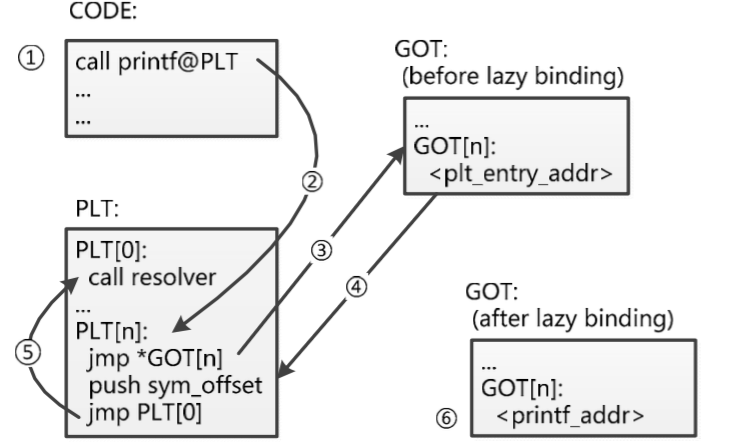
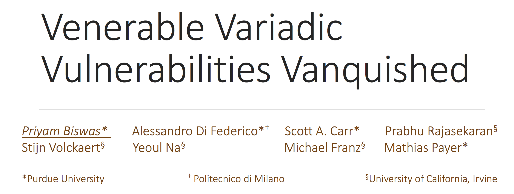

---
presentation:
  width: 1600
  height: 900
  slideNumber: 'c/t'
  showSlideNumber: "all"
  center: true
  enableSpeakerNotes: true
  theme: none.css
---

<!-- slide data-notes="" -->

# 二进制漏洞挖掘与利用

### 格式化字符串

<!-- slide data-notes="" -->

## 格式化字符串

    function
    printf                                                                                              <cstdio>
    ------------------------------------------------------------------------------------------------------------
    int printf ( const char * format, ... );
    Print formatted data to stdout
    Writes the C string pointed by format to the standard output (stdout). If format includes format specifiers
    (subsequences beginning with %), the additional arguments following format are formatted and inserted in the
    resulting string replacing their respective specifiers.

格式化字符串，是一些程序设计语言在格式化输出API函数中用于指定输出参数的格式与相对位置的字符串参数，例如C、C++等程序设计语言的printf类函数，其中的转换说明（conversion specification）用于把随后对应的0个或多个函数参数转换为相应的格式输出；格式化字符串中转换说明以外的其它字符原样输出

<!-- slide data-notes="" -->

## 格式化字符串

| 字符   | 描述                                                                                                            |
| ---- | ------------------------------------------------------------------------------------------------------------- |
| d, i | 有符号十进制数值int。`'%d'`与`'%i'`对于输出是同义；但对于`scanf()`输入二者不同，其中%i在输入值有前缀0x或0时，分别表示16进制或8进制的值。                          |
| u    | 十进制unsigned int。如果指定了精度，则输出的数字不足时在左侧补0。默认精度为1。精度为0且值为0，则输出为空。                                                 |
| x, X | 16进制unsigned int。`'x'`使用小写字母；`'X'`使用大写字母。如果指定了精度，则输出的数字不足时在左侧补0。                                              |
| o    | 8进制unsigned int。如果指定了精度，则输出的数字不足时在左侧补0。默认精度为1。精度为0且值为0，则输出为空。                                                 |
| s    | 如果没有用l标志，输出null结尾字符串直到精度规定的上限；如果没有指定精度，则输出所有字节。                                                               |
| c    | 如果没有用l标志，把int参数转为unsigned char型输出；                                                                            |
| p    | void \*型                                                                                                      |
| a, A | double型的16进制表示，`"[−]0xh.hhhh p±d"`。其中指数部分为10进制表示的形式。例如：`1025.010`输出为`0x1.004000p+10`。`'a'`使用小写字母，`'A'`使用大写字母。 |
| n    | 不输出字符，但是把已经成功输出的字符个数写入对应的整型指针参数所指的变量。                                                                         |
| %    | `'%'`字面值，不接受任何flags, width, precision or length。                                                              |

<!-- slide data-notes="" -->

## 格式化占位符

格式化字符串中的占位符用于指明输出的参数值如何格式化。

-   格式化占位符（format placeholder），语法是：
    `%[parameter][flags][field width][.precision][length]type`
-   Parameter可以忽略或者是：

| 字符  | 描述                                                                                                                                                                                           |
| --- | -------------------------------------------------------------------------------------------------------------------------------------------------------------------------------------------- |
| n$  | n是用这个格式说明符（specifier）显示第几个参数；这使得参数可以输出多次，使用多个格式说明符，以不同的顺序输出。 如果任意一个占位符使用了parameter，则其他所有占位符必须也使用parameter。这是POSIX扩展，不属于ISO C。例：`printf("%2$d %2$#x; %1$d %1$#x",16,17)` 产生"17 0x11; 16 0x10" |

<!-- slide data-notes="" -->

## 格式化占位符

Flags可为0个或多个：

| 字符  | 描述                                                                                                            |
| --- | ------------------------------------------------------------------------------------------------------------- |
| +   | 总是表示有符号数值的'+'或'-'号，缺省情况是忽略正数的符号。仅适用于数值类型。                                                                     |
| 空格  | 使得有符号数的输出如果没有正负号或者输出0个字符，则前缀1个空格。如果空格与'+'同时出现，则空格说明符被忽略。                                                      |
| -   | 左对齐。缺省情况是右对齐。                                                                                                 |
| `#` | 对于'g'与'G'，不删除尾部0以表示精度。对于'f', 'F', 'e', 'E', 'g', 'G', 总是输出小数点。对于'o', 'x', 'X', 在非0数值前分别输出前缀0, 0x, and 0X表示数制。 |
| 0   | 如果width选项前缀以0，则在左侧用0填充直至达到宽度要求。例如printf("%2d", 3)输出" 3"，而printf("%02d", 3)输出"03"。如果0与-均出现，则0被忽略，即左对齐依然用空格填充。  |

<!-- slide data-notes="" -->

## 格式化占位符

### Field Width

给出显示数值的最小宽度，典型用于制表输出时填充固定宽度的表目。实际输出字符的个数不足域宽，则根据左对齐或右对齐进行填充。实际输出字符的个数超过域宽并不引起数值截断，而是显示全部。宽度值的前导0被解释为0填充标志，如上述；前导的负值被解释为其绝对值，负号解释为左对齐标志。如果域宽值为\*，则由对应的函数参数的值为当前域宽。

### Precision

通常指明输出的最大长度，依赖于特定的格式化类型。对于d、i、u、x、o的整型数值，是指最小数字位数，不足的位要在左侧补0，如果超过也不截断，缺省值为1。对于a,A,e,E,f,F的浮点数值，是指小数点右边显示的数字位数，必要时四舍五入或补0；缺省值为6。对于g,G的浮点数值，是指有效数字的最大位数；缺省值为6。对于s的字符串类型，是指输出的字节的上限，超出限制的其它字符将被截断。如果域宽为\*，则由对应的函数参数的值为当前域宽。如果仅给出了小数点，则域宽为0。

<!-- slide data-notes="" -->

## 格式化占位符

Length指出浮点型参数或整型参数的长度。可以忽略，或者是下述：

| 字符  | 描述                                                                                          |
| --- | ------------------------------------------------------------------------------------------- |
| hh  | 对于整数类型，printf期待一个从char提升的int尺寸的整型参数。                                                        |
| h   | 对于整数类型，printf期待一个从short提升的int尺寸的整型参数。                                                       |
| l   | 对于整数类型，printf期待一个long尺寸的整型参数。                                                               |
| l   | 对于浮点类型，printf期待一个double尺寸的整型参数。对于字符串s类型，printf期待一个wchar_t指针参数。 |
| ll  | 对于整数类型，printf期待一个long long尺寸的整型参数。Microsoft也可以使用I64。                                        |
| L   | 对于浮点类型，printf期待一个long double尺寸的整型参数。                                                        |
| z   | 对于整数类型，printf期待一个size_t尺寸的整型参数。                                                             |
| j   | 对于整数类型，printf期待一个intmax_t尺寸的整型参数。                                                           |
| t   | 对于整数类型，printf期待一个ptrdiff_t尺寸的整型参数。                                                          |

<!-- slide data-notes="" -->

## 漏洞

### 如果用户可以控制格式化字符串？

正常：

    char str[100];
    scanf("%s",str);
    printf("%s",str);

危险

    char str[100];
    scanf("%s",str);
    printf(str);

`printf("%s",str)----->printf(str)!!!!!!!`

<!-- slide data-notes="" -->

## 误用

格式化占位符和参数是一一对应关系

### 参数较少？

    printf("%d");

### 参数较多？

    printf(“%d\n”, 3, “extra_string”);

<!-- slide data-notes="" -->

## 代码示例

```c
#include <stdio.h>
int main(int argc,char** argv)
{
        printf("argc: %d\n",argc);
        for(int i = 0;i < argc;i++)
        {
                printf("argv[%d]: %s",i,argv[i]);
        }
        printf("argc: \n",argc);//more arguments
        printf("%08x %08x %08x %08x");//fewer arguments
        printf(argv[1]);
        printf("\n");
        return 0;
}
```
```c
$ gcc -m32 -fno-stack-protector -z execstack print.c -o print
print.c: In function ‘main’:
print.c:9:9: warning: too many arguments for format [-Wformat-extra-args]
  printf("argc: \n",argc);//more arguments
         ^
print.c:10:9: warning: format ‘%x’ expects a matching ‘unsigned int’ argument [-Wformat=]
  printf("%08x %08x %08x %08x");//fewer arguments
         ^
print.c:10:9: warning: format ‘%x’ expects a matching ‘unsigned int’ argument [-Wformat=]
print.c:10:9: warning: format ‘%x’ expects a matching ‘unsigned int’ argument [-Wformat=]
print.c:10:9: warning: format ‘%x’ expects a matching ‘unsigned int’ argument [-Wformat=]
print.c:11:2: warning: format not a string literal and no format arguments [-Wformat-security]
  printf(argv[1]);
```

<!-- slide data-notes="" -->

## 代码示例

```c
#include <stdio.h>
int main(int argc,char** argv)
{
        printf("argc: %d\n",argc);
        for(int i = 0;i < argc;i++)
        {
                printf("argv[%d]: %s",i,argv[i]);
        }
        printf("argc: \n",argc);//more arguments
        printf("%08x %08x %08x %08x");//fewer arguments
        printf(argv[1]);
        printf("\n");
        return 0;
}
```

```c
$ ./print %08x
argc: 2
argv[0]: ./print
argv[1]: %08x
argc:
00000002 ffe7b329 0804853b 00000002
00000002
```

<!-- slide data-notes="" -->

## 漏洞利用

* 读取数据
    - %x
    - %d
    - %s
* 写入数据
    - %n

<!-- slide data-notes="" -->

## 读取数据


```c
include <stdio.h>
#include <stdlib.h>

int main()
{
        char buf[100];
        fgets(buf, 100, stdin);
        printf(buf);
        printf("\n");
        return 0;
}
```


```py
$ python -c "print '%x'*49" | ./print2
64f7eff5a0f7ddd6bbff9d978eff9d988ce0782578257825782578257825782578257825782578257825782578257825782578257825782578257825782578257825782578257825782578257825782578257825782578257825782578257825782578257825782578257825782578257825a7825f7eff3dcff9d97f00f7d65637f7eff000f7eff0000f7d656371ff9d9884ff9d988c000f7eff000f7f4ec04f7f4e0000
$ python -c "print '%x'*50" | ./print2
64f7f895a0f7e676bbffdfd03effdfd13ce0782578257825782578257825782578257825782578257825782578257825782578257825782578257825782578257825782578257825782578257825782578257825782578257825782578257825782578257825782578257825782578257825257825f7f893dcffdfd0a00f7def637f7f89000f7f890000f7def6371ffdfd134ffdfd13c000f7f89000f7fd8c04f7fd80000
$ python -c "print '%x'*100" | ./print2
64f7f175a0f7df56bbffcc85ceffcc86cce0782578257825782578257825782578257825782578257825782578257825782578257825782578257825782578257825782578257825782578257825782578257825782578257825782578257825782578257825782578257825782578257825257825f7f173dcffcc86300f7d7d637f7f17000f7f170000f7d7d6371ffcc86c4ffcc86cc000f7f17000f7f66c04f7f660000
```


```py
$ python -c "print '%08x, '*16" | ./print2
00000064, f7f415a0, f7e1f6bb, ffef4d4e, ffef4e4c, 000000e0, 78383025, 3025202c, 202c7838, 78383025, 3025202c, 202c7838, 78383025, 3025202c, 202c7838, 78383025,
```

<!-- slide data-notes="" -->
## 读取数据

**$操作符**

读取一个特定的参数

```c
printf("%3$s", 1, "b", "c", 4);
```

将显示`3`而不是对应顺序的`1`。其他例子：

-   `printf("%3$d",1,2,3);`，显示`3`
-   `printf("%3$d %2$d %1$d",1,2,3);`，显示`3 2 1`

读取栈上第100个dword数据

```c
$ python -c "print '%100$08x'" | ./print2
ffa3cad0
```

<font color=Red>通过$操作符读取任意地址数据</font>

<!-- slide data-notes="" -->

## 写入数据

* `%n`

    | 操作符 | 说明                                    |
    | --- | ------------------------------------- |
    | n   | 不输出字符，但是把已经成功输出的字符个数写入对应的整型指针参数所指的变量。 |

目标地址

-   格式化字符串的参数
    目标值
-   到目前为止成功输出的字符个数

<!-- slide data-notes="" -->
## 写入数据

* 任意地址任意写
    -   任意地址： `$`控制
    -   任意值： `%xd`通过控制x改变输出的字符个数

* getshell
    - 任意地址任意写------>getshell?
    - <font color=Red>覆盖got表！！</font>

<!-- slide data-notes="" -->
## AAR和AAW
* AAR：任意地址读（arbitrary address read）
* AAW：任意地址写（arbitrary address write）
* 能做到这两点就非常强了，重点是如何拿到shell
* Q：写哪些地址，写什么值进去，可以劫持控制流？
* A：GOT表

<!-- slide data-notes="" -->
## GOT表
GOT表（Global Offset Table），工作原理如下图所示：



<!-- slide data-notes="" -->
## 防御
* 调用约定
    - caller将所有参数放在栈上
    - callee假设所有参数都在栈上
* 漏洞确实存在，假设caller传的参数和callee期望的参数个数不同
* 解决方案：在caller和callee之间做验证
    * caller一共传了多少参数？
        * 编译器在编译阶段可以知道
    * callee使用了多少参数？
        * 仅在运行时方可知道

<!-- slide data-notes="" -->
## 防御
<div class="middle">


</div>

<!-- slide class="middle"-->

# Thanks for watching!
