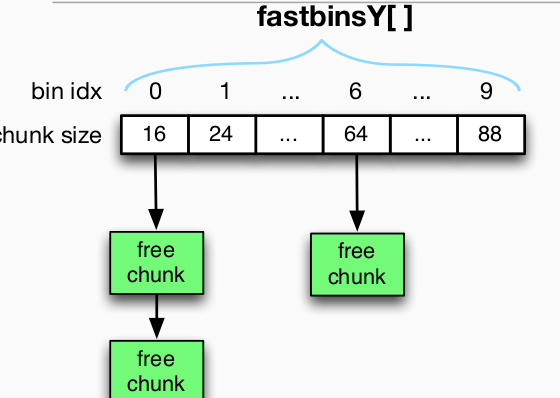
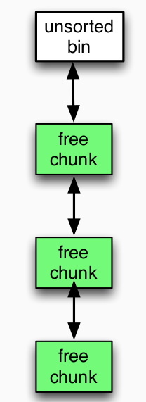
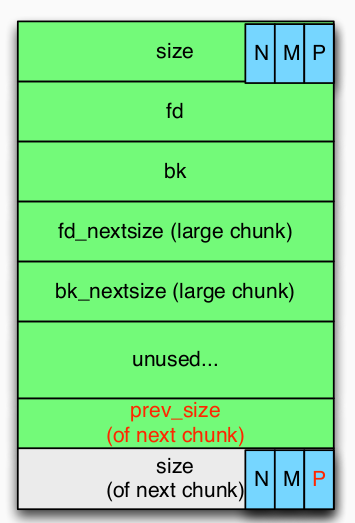
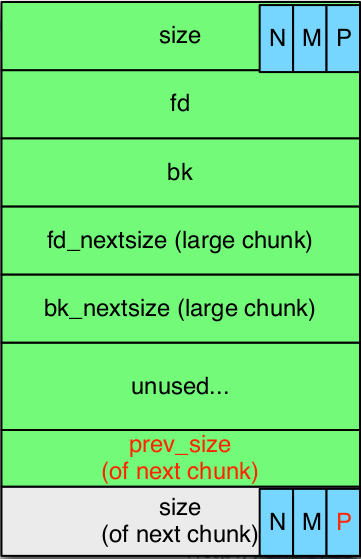

---
presentation:
  width: 1600
  height: 900
  slideNumber: 'c/t'
  showSlideNumber: "all"
  center: true
  enableSpeakerNotes: true
  theme: none.css
---

<!-- slide data-notes="" -->
# 堆
<!-- slide data-notes="" -->
## 堆的使用
xxx|xxx
----|----
程序员应用|
libc 函数|malloc(), realloc(), free(), brk(), mmap(), munmap()
内核调用|brk nmap munmap
<!-- slide data-notes="" -->
## Linux 进程布局

<!-- slide data-notes="" -->
## 堆 vs. 栈
<div id="left">

### <font color=Red>堆</font>
- 动态分配
- 对象，大缓冲区，结构体。。。
### <font color=#0099ff>更慢，手动</font>
- malloc / calloc / recalloc / free
- new / delete
</div>

<div id="right">

### <font color=Red>栈</font>
- 在编译阶段就固定的内存分配
- 局部变量，返回地址，函数地址
### <font color=#0099ff>快，自动</font>
- 编译阶段就完成
- 抽象出分配/取消分配的概念
</div>

<!-- slide data-notes="" -->
## 内存分配器的目标
### 效率
- 快速获取内存
- 快速释放内存
### 内存碎片
- 极少的内存浪费
- 极少的内存碎片
<!-- slide data-notes="" -->
## 堆的两种状态
- free
- allocted
### 减少内存浪费
优先使用标记为free的内存
### 减少内存碎片
把free的内存连起来管理
<!-- slide data-notes="" -->
## 堆的实现
不同的堆实现
- dlmalloc
- ptmalloc (glibc)
- tcmalloc (Chrome, replaced)
- jemalloc (Firefox/Facebook)
- nedmalloc
- Hoard
<!-- slide data-notes="" -->
## glibc的堆实现
### chunk
堆的基本单位是一个一个chunk块，chunk的结构如下：
```c
struct malloc_chunk {
    INTERNAL_SIZE_T    prev_size;  /* Size of previous chunk (if free).  */
    INTERNAL_SIZE_T    size;     /* Size in bytes, including overhead. */
    struct malloc_chunk* fd;       /* double links -- used only if free. */
    struct malloc_chunk* bk;
    /* Only used for large blocks: pointer to next larger size.  */
    struct malloc_chunk* fd_nextsize; /* double links -- used only if free. */
    struct malloc_chunk* bk_nextsize;
 };
```

<!-- slide data-notes="" -->
## chunk size
为了执行效率，chunk的长度会进行对齐
- 32bit： （x + 4）对齐到8

data size|0 ~ 4|5 ~ 12|13 ~ 20|...|53 ~ 60|61 ~ 68|69 ~ 76|77 ~ 84
----|----|:----|----|----|----|----|----|----|
chunk size | 16|16|24|...|64|72|80|88

- 64bit： （x + 4）对齐到16

data size|0 ~ 8|9 ~ 24|25 ~ 40|...|105 ~ 120|121 ~ 136|137 ~ 152|153 ~ 168
----|----|----|----|----|----|----|----|----|
chunk size |32|32|24|...|64|72|80|88

<!-- slide data-notes="" -->
## free chunk 

如果前面的chunk是空闲状态，prev_size则记录前面chunk的大小
其中，size不同于pre_size的是，size中的低三位作为flag。
- 最低位:前一个 chunk 是否正在使用
- 倒数第二位:当前 chunk 是否是通过 mmap 方式产生的
- 倒数第三位:这个 chunk 是否属于一个线程的 arena 
需要注意的是，如果该free chunk落在fastbin中，这些数据将不会被设置。
<!-- slide data-notes="" -->
## chunk
### 正在被使用的chunk
- 被程序的数据指针指向
- 长度是对于chunk本身是可知的
    - <font color=Red>free()因此得以工作</font>
### free状态的chunk
- 不再被程序指向
- 稍后会被<font color=Red>重复使用</font>来回应内存分配
- 需要有效的组织管理free chunk以便于maclloc()来分配
- how？

<!-- slide data-notes="" -->
## free chunks的组织管理
### 链表
通常的，一个链表拥有的chunk长度相同
- 需要多个链表
    - 以管理不同长度的chunk
    - 单链表或双向链表
- 链表被分组为几个BINs
    - fastbins,unsorted_bin,smallbins,largebins
<!-- slide data-notes="" -->
## fastbin
管理16bytes-64bytes（64位下为32bytes~128bytes）的chunk的`单向链表`数据结构，由于需要加速程序执行速度的原因，linux对于fastbin的检查较为松散，因此利用起来也较为方便。
### 单向链表
- 快
- 释放后的chunk插入fastbin表头
- 只使用fd指针，bk指针，pre_size,p bit无效 
<div id="left">



</div>
<div id="right">


</div>
<!-- slide data-notes="" -->

## unsorted_bin
### malloc()
- 如果搜索到unsorted_bin，对它管理的chunk一一处理
    - 把chunk归放到small/large bin（唯一增加small/large bin的地方）
    - 如果长度刚好满足要求，就返回chunk并结束搜索
### free()
- 如果free的chunk不能放到fastbin，就放到unsorted_bin。
- 向前面的空闲的chunk合并
    - 通过检查p bit
- 向后面的空闲的chunk合并
    - 通过检查它后一个chunk p bit
- 设置fd，bk指针，后一个chunk的prev_size, p bit 
<div id="left">



</div>
<div id="right">



</div>
<!-- slide data-notes="" -->

## Small-bins
### malloc()
- 如果找到对应长度的chunk，则直接返回
### free()
- 不会直接把chunk放进small-bin
### fd/bk被设置
- 当chunk从unsorted_bin删除时。
<div id="left">


</div>
<div id="right">



</div>
<!-- slide data-notes="" -->

## Large-bins
<div id="left">


</div>
<div id="right">

### malloc()
- 如果large-bin被搜索到
    - 寻找满足要求的最小chunk
    - 或者分裂大chunk，一份返回给用户，一份加入到unsorted_bin
### free()
- 不会直接放到large-bin
### fd/bk,	fd_nextsize/bk_nextsize 被设置
- 当其从unsorted_bin删除时。

</div>

<!-- slide data-notes="" -->
## top chunk
初次malloc()后，没有被分出去的堆。

<!-- slide class="middle"-->

# Thanks for watching!
