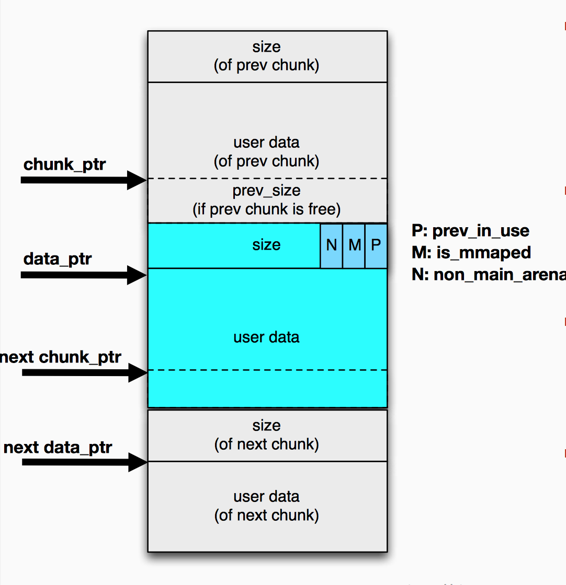
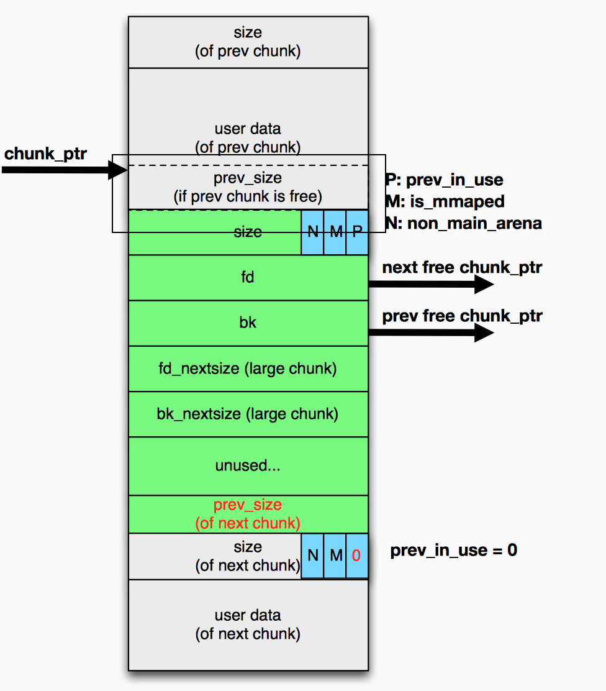
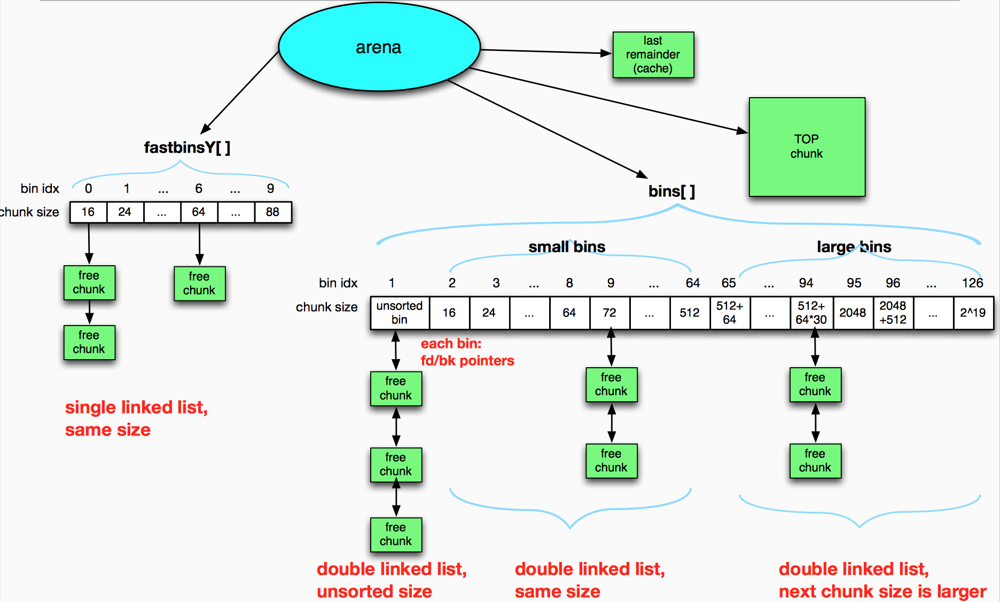
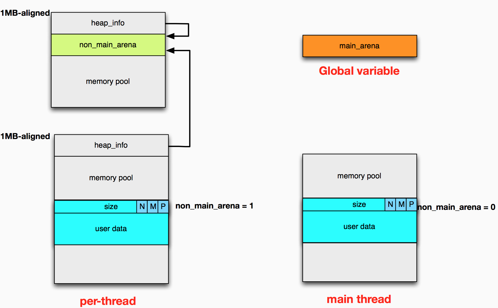
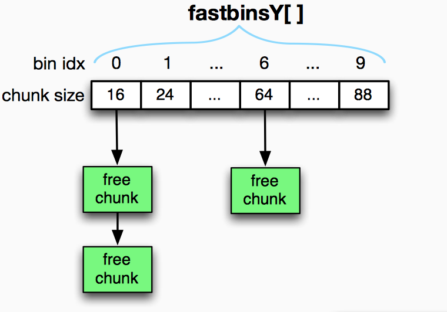
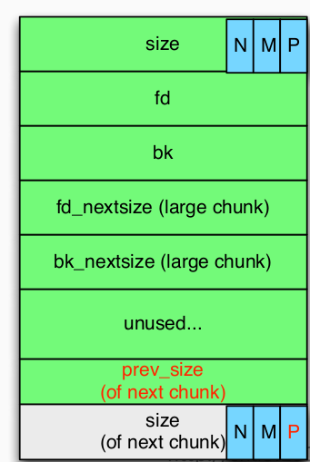
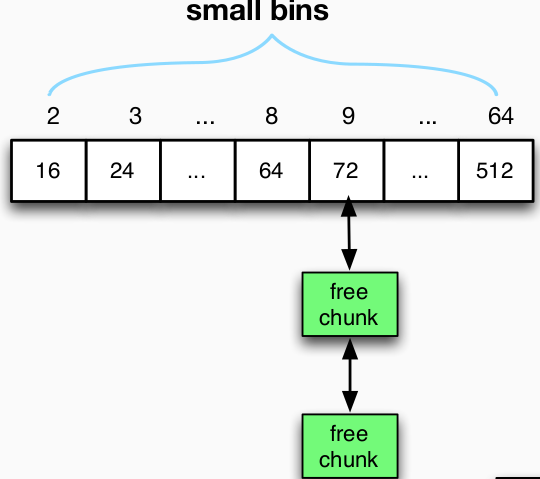
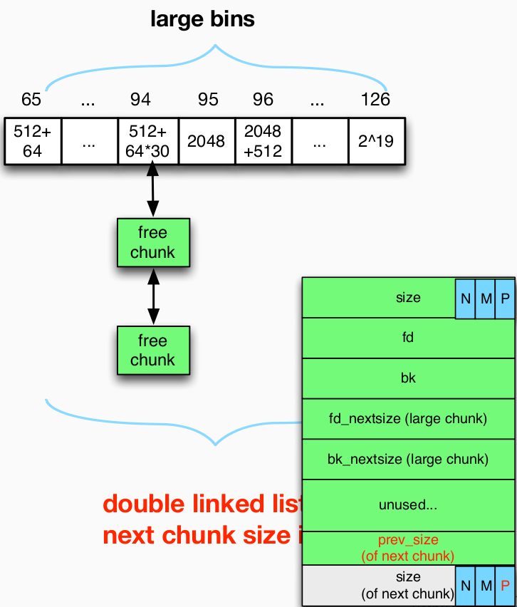
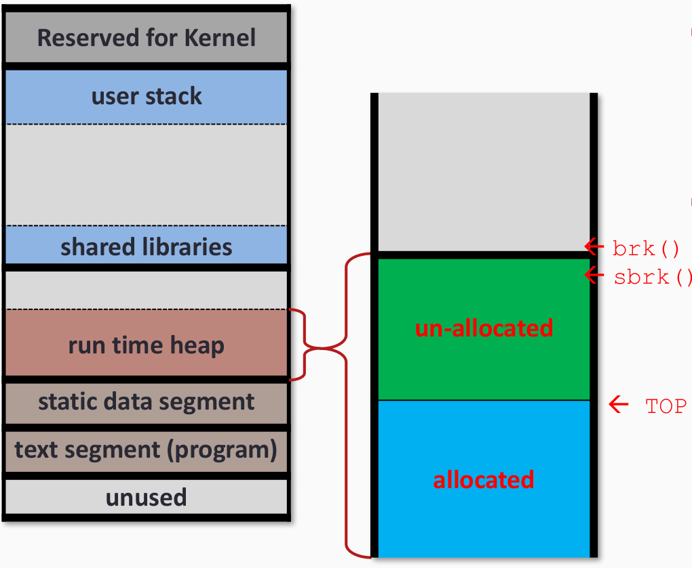

---
presentation:
  width: 1600
  height: 900
  slideNumber: 'c/t'
  showSlideNumber: "all"
  center: true
  enableSpeakerNotes: true
  theme: none.css
---

<!-- slide data-notes="" -->
# 二进制漏洞挖掘与利用
### Glibc堆分配机制
<!-- slide data-notes="" -->
## 堆的使用
分类|函数
----|----
程序员应用|
libc 函数|malloc(), realloc(), free(), brk(), mmap(), munmap()
内核调用|brk nmap munmap

<!-- slide data-notes="" -->
## Linux 进程布局
<div class="middle">


</div>
<!-- slide data-notes="" -->
## 堆 vs. 栈
<div id="left">

* <font color=Red>堆</font>
    - 动态分配
    - 对象，大缓冲区，结构体...
* <font color=#0099ff>更慢，手动</font>
    - malloc / calloc / recalloc / free
    - new / delete
</div>

<div id="right">

* <font color=Red>栈</font>
    - 在编译阶段就固定的内存分配
    - 局部变量，返回地址，函数地址
* <font color=#0099ff>快，自动</font>
    - 编译阶段就完成
    - 抽象出分配/取消分配的概念
</div>

<!-- slide data-notes="" -->
## 内存分配器的目标
* 效率
    - 快速获取内存
    - 快速释放内存
* 内存碎片
    - 极少的内存浪费
    - 极少的内存碎片
* 堆的两种状态
    - free
    - allocted
* 减少内存浪费
    - 优先使用标记为free的内存
* 减少内存碎片
    - 把free的内存连起来管理

<!-- slide data-notes="" -->
## 堆的实现
不同的堆实现
- dlmalloc
- ptmalloc (glibc)
- tcmalloc (Chrome, replaced)
- jemalloc (Firefox/Facebook)
- nedmalloc
- Hoard
<!-- slide data-notes="" -->
## glibc的堆实现
* chunk
堆的基本单位是一个一个chunk块，chunk的结构如下：
    ```c
    struct malloc_chunk {
        INTERNAL_SIZE_T    prev_size;  /* Size of previous chunk (if free).  */
        INTERNAL_SIZE_T    size;     /* Size in bytes, including overhead. */
        struct malloc_chunk* fd;       /* double links -- used only if free. */
        struct malloc_chunk* bk;
        /* Only used for large blocks: pointer to next larger size.  */
        struct malloc_chunk* fd_nextsize; /* double links -- used only if free. */
        struct malloc_chunk* bk_nextsize;
     };
    ```

    

<!-- slide data-notes="" -->
## chunk size
为了执行效率，chunk的长度会进行对齐
- 32bit： （x + 4）对齐到8

data size|0 ~ 4|5 ~ 12|13 ~ 20|...|53 ~ 60|61 ~ 68|69 ~ 76|77 ~ 84
----|----|:----|----|----|----|----|----|----|
chunk size | 16|16|24|...|64|72|80|88

- 64bit： （x + 4）对齐到16

data size|0 ~ 8|9 ~ 24|25 ~ 40|...|105 ~ 120|121 ~ 136|137 ~ 152|153 ~ 168
----|----|----|----|----|----|----|----|----|
chunk size |32|32|24|...|64|72|80|88
<!-- slide data-notes="" -->
## In used chunk
<div id="left">


</div>
<div id="right">

- 如果前面的chunk是使用状态，prev_size则属于前一个堆块。
- prev_in_use表明前一个堆块是否free状态（且不在fastbins内）
- is_mmaped说明内存来自于mmap()
- non_main_arena表明该堆块由非主线程分配


</div>
<!-- slide data-notes="" -->
## free chunk
<div id="left">


</div>

<div id="right">

如果前面的chunk是空闲状态，prev_size则记录前面chunk的大小。
下一个堆块的prev_size记录本堆块的大小。
其中，size不同于pre_size的是，size中的低三位作为flag。
- 最低位:前一个 chunk 是否正在使用
- 倒数第二位:当前 chunk 是否是通过 mmap 方式产生的
- 倒数第三位:这个 chunk 是否属于一个线程的 arena
需要注意的是，如果该free chunk落在fastbin中，这些数据将不会被设置。
</div>

<!-- slide data-notes="" -->
## chunk
* 正在被使用的chunk
    - 被程序的数据指针指向
    - 长度是对于chunk本身是可知的
    - <font color=Red>free()因此得以工作</font>
* free状态的chunk
    - 不再被程序指向
    - 稍后会被<font color=Red>重复使用</font>来回应内存分配
    - 需要有效的组织管理free chunk以便于maclloc()来分配
    - how？

<!-- slide data-notes="" -->
## free chunks的组织管理
* 链表，通常的，一个链表拥有的chunk长度相同
    - 需要多个链表
        - 以管理不同长度的chunk
        - 单链表或双向链表
    - 链表被分组为几个BINs
        - fastbins,unsorted_bin,smallbins,largebins
<!-- slide data-notes="" -->
## Arena(32bit)
<div class="middle">


</div>

<!-- slide data-notes="" -->
## Get Arena
<div class="middle">


</div>
<!-- slide data-notes="" -->
## fastbin
管理16bytes-64bytes（64位下为32bytes~128bytes）的chunk的`单向链表`数据结构，由于需要加速程序执行速度的原因，linux对于fastbin的检查较为松散，因此利用起来也较为方便。
* 单向链表
    - 特点：快
    - 释放后的chunk插入fastbin表头
    - 只使用fd指针，bk指针，pre_size,p bit无效
<div id="left">



</div>
<div id="right">



</div>
<!-- slide data-notes="" -->

## unsorted_bin

* malloc()
    - 如果搜索到unsorted_bin，对它管理的chunk一一处理
        - 把chunk归放到small/large bin（唯一增加small/large bin的地方）
        - 如果长度刚好满足要求，就返回chunk并结束搜索
* free()
    - 如果free的chunk不能放到fastbin，就放到unsorted_bin。
    - 向前面的空闲的chunk合并
        - 通过检查p bit
    - 向后面的空闲的chunk合并
        - 通过检查它后一个chunk p bit
    - 设置fd，bk指针，后一个chunk的prev_size, p bit

<!-- slide data-notes="" -->
## Small-bins


<div id="left">

small-bins特点：
* malloc()
    - 如果找到对应长度的chunk，则直接返回
* free()
    - 不会直接把chunk放进small-bin
* fd/bk被设置
    - 当chunk从unsorted_bin删除时。

</div>
<div id="right">



</div>
<!-- slide data-notes="" -->

## Large-bins
<div id="left">



</div>
<div id="right">

* malloc()
    - 如果large-bin被搜索到
        - 寻找满足要求的最小chunk
        - 或者分裂大chunk，一份返回给用户，一份加入到unsorted_bin
* free()
    - 不会直接放到large-bin
* fd/bk,	fd_nextsize/bk_nextsize 被设置
    - 当其从unsorted_bin删除时。

</div>

<!-- slide data-notes="" -->
## top chunk
初次malloc()后，没有被分出去的堆。

<div class="middle">


</div>

<!-- slide data-notes="" -->
## malloc过程
<div id="left">


</div>
<div id="right">

- 检查长度是否符合fastbin的范围，如果在其中找到，则
    - 将其从单链表删除
    - 更新fd指针
- 检查长度是否符合smallbins的范围，如果在其中找到，则
    - 从双向链表中删除
    - 更新fd/bk指针
- 如果尝试分配长度很大的chunk，不直接搜索large-bin，而是进行chunk整理
    - 把fastbin放到unsorted_bin中
    - 更新下一个chunk的prev_size和p bit
    - 合并空闲堆快

</div>

<!-- slide data-notes="" -->
## malloc过程
<div id="left">


</div>
<div id="right">

- 在unsorted_bin中搜索
    - 如果last_reminder cache足够大，就分一块出来
    - 如果找到合适大小的chunk就返回
    - 对于搜索的每个chunk，将其按照范围放进small/large bins
- 更新fd/bk指针

</div>

<!-- slide data-notes="" -->
## malloc过程
<div id="left">


</div>
<div id="right">

- 在small/large中搜索
    - 在最小的非空small/large bin中找到足够大的chunk
        - unlink，split

</div>

<!-- slide data-notes="" -->
## malloc过程
<div id="left">


</div>
<div id="right">

- 从TOP chunk中获取内存
    - 如果top chunk足够大，就分一部分出来
    - 如果没有fastbin就从系统获取内存
    - 再次整理fastbin和unsorted_bin

</div>

<!-- slide data-notes="" -->
## free
<div id="left">


</div>
<div id="right">

- 检查元数据的安全性
    - e.g. : ptr->fd->bk == ptr
- 如果大小在fastbin范围内就放到fastbin里面
    - 更新fastbin，fd
- 合并前一个free状态的chunk
    - unlink
- 合并后一个free状态的chunk
    - unlink，top

</div>

<!-- slide data-notes="" -->
## unlink
* 从链表中删除结点，并更新BK/FD
<div id="left">


</div>
<div id="right">

```c
#define unlink(p,BK,FD)
{
    FD = p -> fd;
    BK = p -> bk;
    FD -> bk = BK;
    BK -> fd = FD;
}
```

</div>

<!-- slide data-notes="" -->
## 什么时候进行unlink
<div id="left">


</div>
<div id="right">

* free chunk从双向链表中被取出
    - 一种情况：与它物理相邻的堆块合并
    - 另一种情况：回应系统的分配请求

</div>

<!-- slide data-notes="" -->
## unlink
* 如果空闲堆块被损害？
<div class="middle">


</div>


<!-- slide data-notes="" -->
## unlink
### 当chunk被unlink时

<!-- slide data-notes="" -->
## 实例代码：fastbin和smallbin

```c
//fastbins
for(i = 0;i < 8;i++)
{
    alloc_size = 8 * i + 4;
    chunk_size = (alloc_size + 7) / 8 * 8
    p1 = (char*) malloc(alloc_size);
    p2 = (char*) malloc(alloc_size);
    p3 = (char*) malloc(alloc_size);
    p4 = (char*) malloc(alloc_size);
    printf("alloc_size: %d,chunk_size: %d,p1: %p,p2: %p,p3: %p,p4: %p",alloc_size,chunk_size,p1,p2,p3,p4);
    memset(p1,'a',alloc_size);
    memset(p2,'b',alloc_size);
    memset(p3,'c',alloc_size);
    memset(p4,'d',alloc_size);
    free(p2);
    free(p3);
}
```


```c
//smallbins
for(i = 8;i < 12;i++)
{
    alloc_size = 8 * i + 4;
    chunk_size = (alloc_size + 7) / 8 * 8
    p1 = (char*) malloc(alloc_size);
    p2 = (char*) malloc(alloc_size);
    p3 = (char*) malloc(alloc_size);
    p4 = (char*) malloc(alloc_size);
    printf("alloc_size: %d,chunk_size: %d,p1: %p,p2: %p,p3: %p,p4: %p",alloc_size,chunk_size,p1,p2,p3,p4);
    memset(p1,'a',alloc_size);
    memset(p2,'b',alloc_size);
    memset(p3,'c',alloc_size);
    memset(p4,'d',alloc_size);
    free(p2);
    free(p3);
}
```

<!-- slide data-notes="" -->

## main_areana 地址
* 运行时libc基地址

* 编译时确定的main_arena的偏移

* 运行时main_arena的地址
0xf7e16000 + 0x001BA420= <font color=Red>0xf7fd0420</font>

<!-- slide data-notes="" -->
## main_arena地址
<div class="middle">


</div>

<!-- slide data-notes="" -->
## main_arena内容
<div class="middle">


</div>
<!-- slide data-notes="" -->
## main_arena内容
<div class="middle">


</div>
<!-- slide data-notes="" -->
## 一言以蔽之
* free()和malloc()依赖于元数据(chunk的头部信息)来
    - 遍历 bins/lists/chunks
    - 将内存返回给用户
* 但是这些元数据没有很好的保护
    - 堆溢出，use-after-free


<!-- slide class="middle"-->

# Thanks for watching!
