---
presentation:
  width: 1600
  height: 900
  slideNumber: 'c/t'
  showSlideNumber: "all"
  center: true
  enableSpeakerNotes: true
  theme: none.css
---

<!-- slide data-notes="" -->
# 堆
<!-- slide data-notes="" -->
## malloc过程
<div id="left">

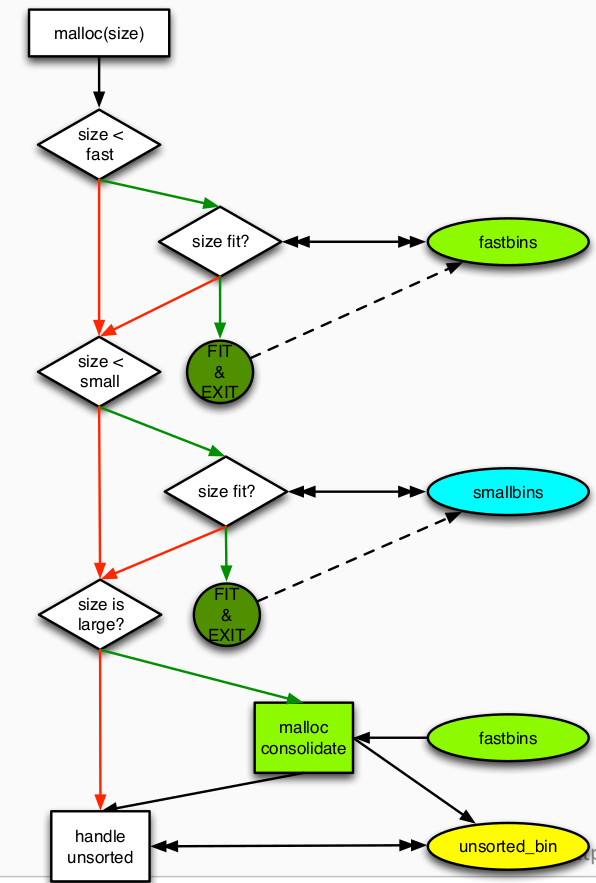

</div>
<div id="right">

- 检查长度是否符合fastbin的范围，如果在其中找到，则
    - 将其从单链表删除
    - 更新fd指针
- 检查长度是否符合smallbins的范围，如果在其中找到，则
    - 从双向链表中删除
    - 更新fd/bk指针
- 如果尝试分配长度很大的chunk，不直接搜索large-bin，而是进行chunk整理
    - 把fastbin放到unsorted_bin中
    - 更新下一个chunk的prev_size和p bit
    - 合并空闲堆快

</div>

<!-- slide data-notes="" -->
## malloc过程
<div id="left">

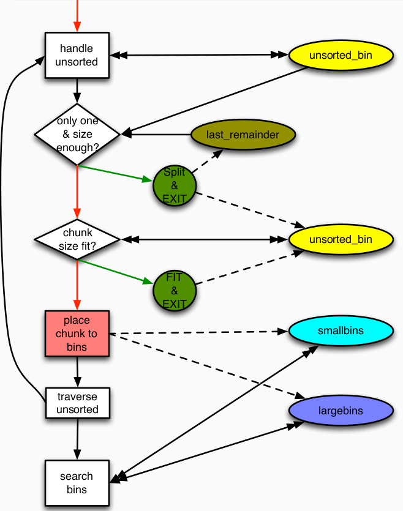

</div>
<div id="right">

- 在unsorted_bin中搜索
    - 如果last_reminder cache足够大，就分一块出来
    - 如果找到合适大小的chunk就返回
    - 对于搜索的每个chunk，将其按照范围放进small/large bins
- 更新fd/bk指针

</div>

<!-- slide data-notes="" -->
## malloc过程
<div id="left">

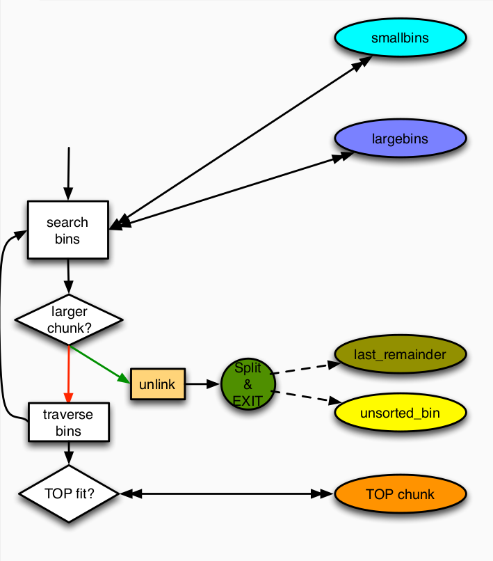

</div>
<div id="right">

- 在small/large中搜索
    - 在最小的非空small/large bin中找到足够大的chunk
        - unlink，split

</div>

<!-- slide data-notes="" -->
## malloc过程
<div id="left">


</div>
<div id="right">

- 从TOP chunk中获取内存
    - 如果top chunk足够大，就分一部分出来
    - 如果没有fastbin就从系统获取内存
    - 再次整理fastbin和unsorted_bin

</div>

<!-- slide data-notes="" -->
## free
<div id="left">

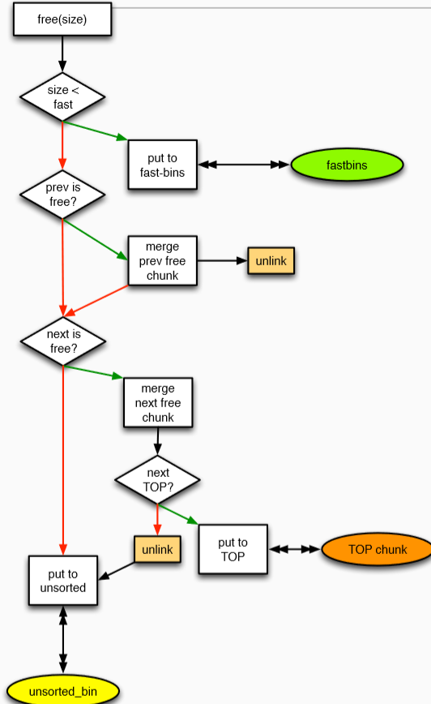

</div>
<div id="right">

- 检查元数据的安全性
    - e.g. : ptr->fd->bk == ptr
- 如果大小在fastbin范围内就放到fastbin里面
    - 更新fastbin，fd
- 合并前一个free状态的chunk
    - unlink
- 合并后一个free状态的chunk
    - unlink，top

</div>

<!-- slide data-notes="" -->
## unlink
### 从链表中删除结点，并更新BK/FD
<div id="left">

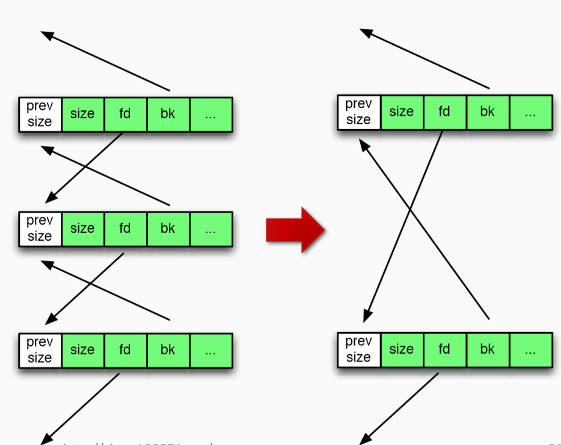

</div>
<div id="right">

```c
#define unlink(p,BK,FD)
{
    FD = p -> fd;
    BK = p -> bk;
    FD -> bk = BK;
    BK -> fd = FD;
}
```

</div>

<!-- slide data-notes="" -->
## 什么时候进行unlink
<div id="left">

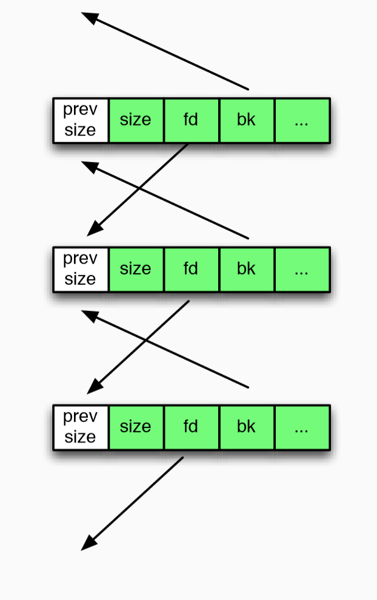

</div>
<div id="right">

### free chunk从双向链表中被取出
- 一种情况：与它物理相邻的堆块合并
- 另一种情况：回应系统的分配请求

</div>

<!-- slide data-notes="" -->
## unlink
### 如果空闲堆块被损害？ 
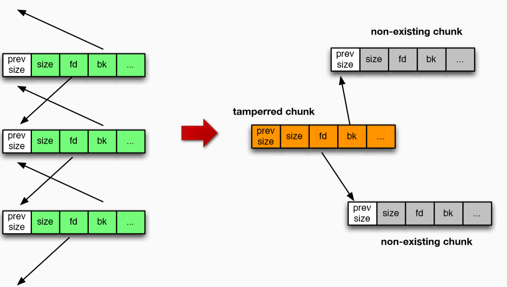


<!-- slide data-notes="" -->
## unlink
### 当chunk被unlink时
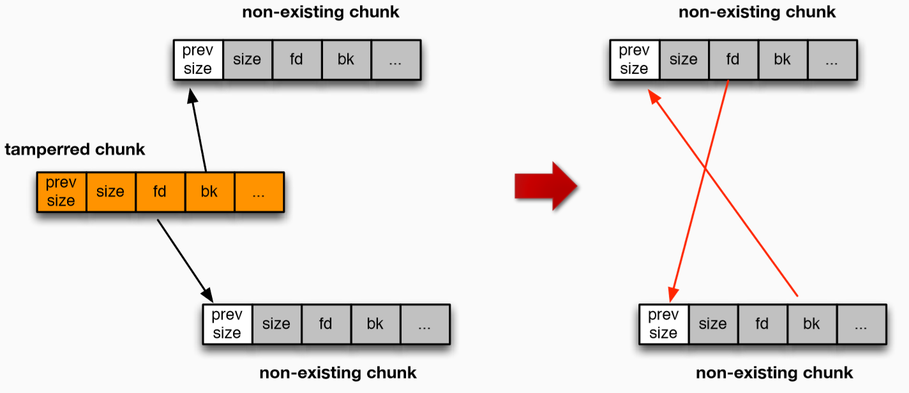
<!-- slide data-notes="" -->
## 实例代码：fastbin和smallbin
<div id="left">

```c
//fastbins
for(i = 0;i < 8;i++)
{
    alloc_size = 8 * i + 4;
    chunk_size = (alloc_size + 7) / 8 * 8
    p1 = (char*) malloc(alloc_size);
    p2 = (char*) malloc(alloc_size);
    p3 = (char*) malloc(alloc_size);
    p4 = (char*) malloc(alloc_size);
    printf("alloc_size: %d,chunk_size: %d,p1: %p,p2: %p,p3: %p,p4: %p",alloc_size,chunk_size,p1,p2,p3,p4);
    memset(p1,'a',alloc_size);
    memset(p2,'b',alloc_size);
    memset(p3,'c',alloc_size);
    memset(p4,'d',alloc_size);
    free(p2);
    free(p3); 
}
```

</div>
<div id="right">

```c
//smallbins
for(i = 8;i < 12;i++)
{
    alloc_size = 8 * i + 4;
    chunk_size = (alloc_size + 7) / 8 * 8
    p1 = (char*) malloc(alloc_size);
    p2 = (char*) malloc(alloc_size);
    p3 = (char*) malloc(alloc_size);
    p4 = (char*) malloc(alloc_size);
    printf("alloc_size: %d,chunk_size: %d,p1: %p,p2: %p,p3: %p,p4: %p",alloc_size,chunk_size,p1,p2,p3,p4);
    memset(p1,'a',alloc_size);
    memset(p2,'b',alloc_size);
    memset(p3,'c',alloc_size);
    memset(p4,'d',alloc_size);
    free(p2);
    free(p3); 
}
```

</div>
<!-- slide data-notes="" -->

## main_areana 地址
### 运行时libc基地址
0x7ffff7a0d000
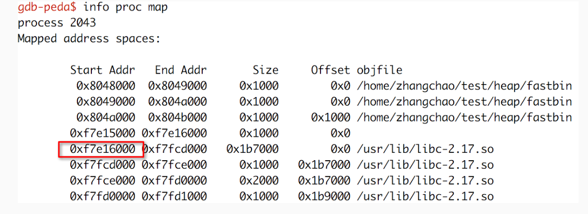
### 编译时确定的main_arena的偏移
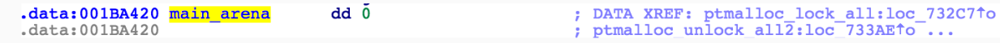
### 运行时main_arena的地址
0xf7e16000 + 0x001BA420= <font color=Red>0xf7fd0420</font>
<!-- slide data-notes="" -->
## main_arena地址
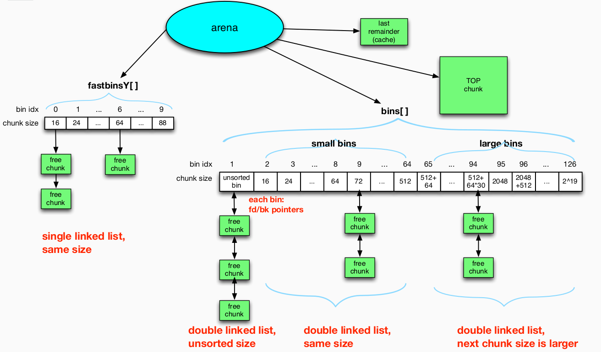

<!-- slide data-notes="" -->
## main_arena内容
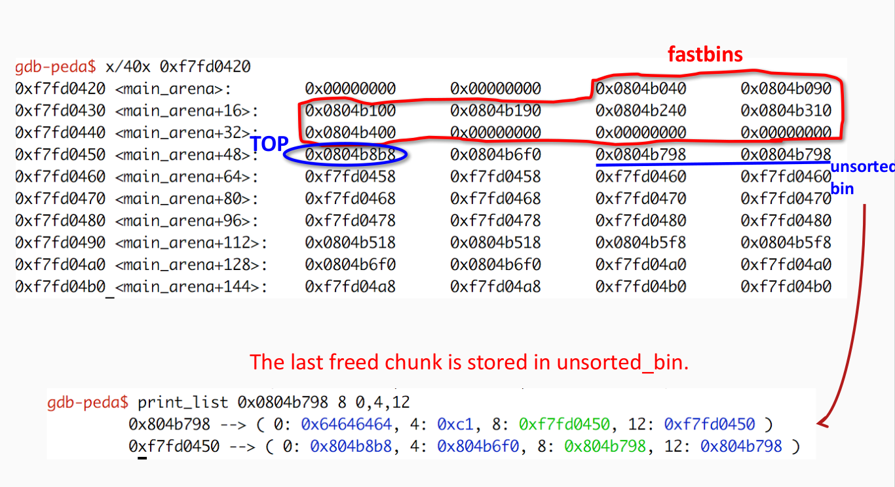
<!-- slide data-notes="" -->
## main_arena内容
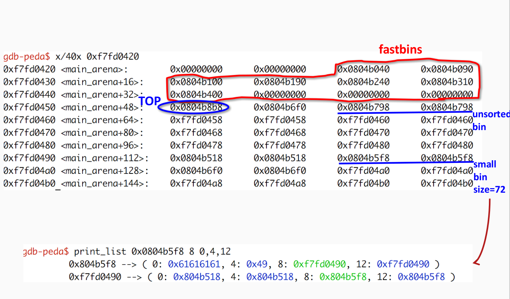
<!-- slide data-notes="" -->
## 一言以蔽之
### free()和malloc()依赖于元数据(chunk的头部信息)来
- 遍历 bins/lists/chunks
- 将内存返回给用户
### 但是这些元数据没有很好的保护
- 堆溢出，use-after-free
<!-- slide class="middle"-->

# Thanks for watching!