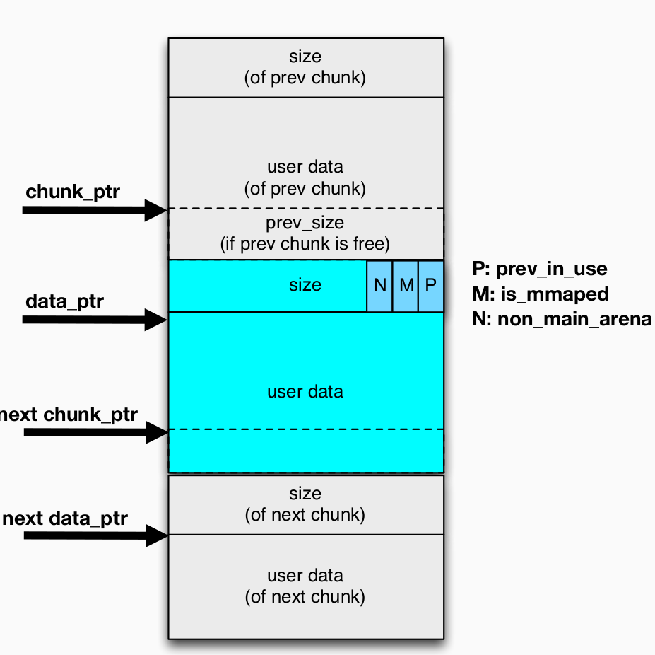
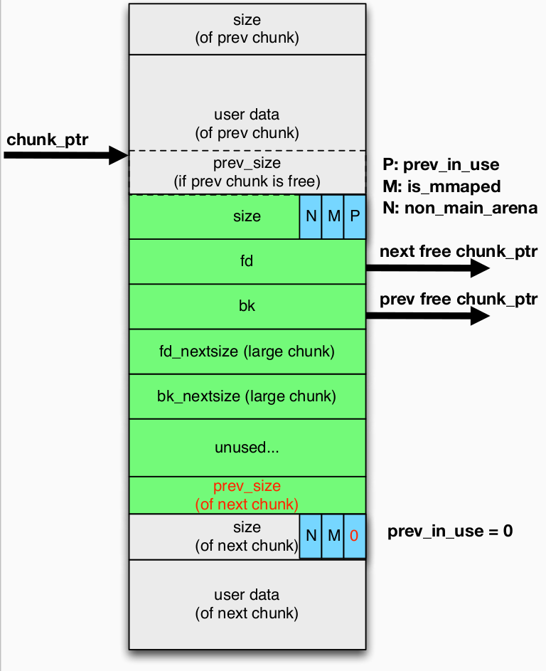
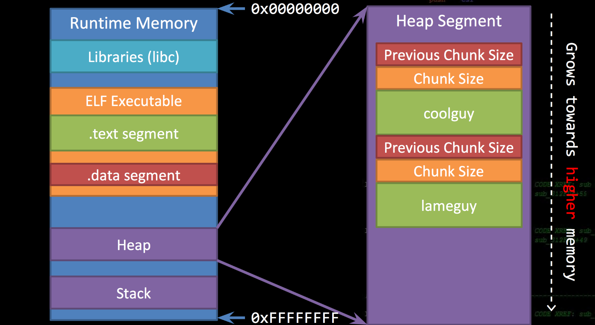
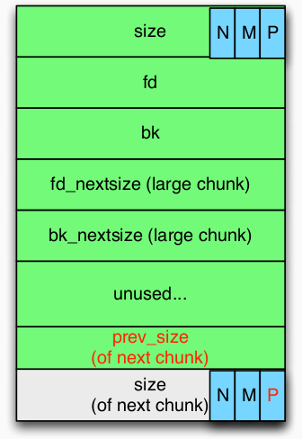

---
presentation:
  width: 1600
  height: 900
  slideNumber: 'c/t'
  showSlideNumber: "all"
  center: true
  enableSpeakerNotes: true
  theme: none.css
---


<!-- slide data-notes="" -->
# 堆的利用

<!-- slide data-notes="" -->
## Glibc：Chunk In Use
<div id="left">



</div>

<div id="right">

### prev_size 区域
- 属于前一个chunk
- 如果前一个chunk是free状态（并且不在fastbin）就会被设置
### prev_in_use
- 若前一个chunk是free状态（并且不在fastbin）则置0
### is_mmaped
- 是否是通过mmap()产生的
### non_main_arena
- 这个 chunk 是否属于一个线程的 arena 

</div>
<!-- slide data-notes="" -->

## Glibc:被释放的chunk

<div id="left">



</div>

<div id="right">

### 下一个chunk的prev_size 
- 这个free chunk的长度
### 下一个chunk的prev_in_use
- 为0
### 但是
- 如果这个被释放的chunk在fastbin这些东西就不会被设置 

</div>

<!-- slide data-notes="" -->
## 堆溢出
- 与堆溢出基本类似
### 栈溢出的目标
- 返回地址
- 保存在栈帧的指针
- 局部函数变量
- 异常句柄
- 其他敏感数据
### 堆溢出的目标
- 堆的元数据
- 对象中的函数指针
- 对象中的vtable指针
- 其他敏感数据
<!-- slide data-notes="" -->
## 例子
```c
struct toystr()
{
    void (* message)(char *);
    char buffer[20];
}
```
```c
coolguy = malloc(sizeof(struct toystr))
lameguy = malloc(sizeof(struct toystr))

coolguy -> message = &print_cool;
lameguy -> message = &print_meh;

puts("Input coolguy's name:");
fgets(coolguy->fuffer,200,stdin);
coolguy->buffer[strcspn(coolguy->buffer,"\n")] = 0;

puts("Input lameguy's name:");
fgets(coolguy->fuffer,200,stdin);
coolguy->buffer[strcspn(coolguy->buffer,"\n")] = 0;

coolguy->message(coolguy->buffer);
lameguy->message(lameguy->buffer);
```
<!-- slide data-notes="" -->
## 例子

<!-- slide data-notes="" -->
## 例子

<!-- slide data-notes="" -->
## 例子
```c

coolguy = malloc(sizeof(struct toystr))
lameguy = malloc(sizeof(struct toystr))

coolguy -> message = &print_cool;
lameguy -> message = &print_meh;

puts("Input coolguy's name:");
fgets(coolguy->fuffer,200,stdin);
coolguy->buffer[strcspn(coolguy->buffer,"\n")] = 0;

puts("Input lameguy's name:");
fgets(coolguy->fuffer,200,stdin);
coolguy->buffer[strcspn(coolguy->buffer,"\n")] = 0;

coolguy->message(coolguy->buffer);
lameguy->message(lameguy->buffer);//<--------被溢出覆盖的函数指针
```
<!-- slide data-notes="" -->
## 思考
- 堆溢出有什么其他的利用方法？
     - ~~对象中的函数指针~~
     - 管理堆的元数据
     - VTable指针
<!-- slide data-notes="" -->
## 堆溢出-元数据

<div id="left">


</div>

<div id="right">

### 溢出一个正在被使用的chunk
- 溢出 p bit （prev_in_use）
    - 从0改变成1
        - 当这个chunk被free，前一个chunk不会被合并。
        * note：只有被free的chunk比fast-bin-size大时才会发生合并操作
    - 从1改变成0
        - 当这个chunk被free时，前一个chunk会被合并
        - Q1:前一个"free"状态chunk的大小？
        - Q2:什么时候会发生合并？
        - 如果合并的free chunk接下来被分配给其他对象，那么两个不同的对象会共享同一段内存

</div>

<font color=Red>
NOTE ：

1. 被分配的chunk不会被arena/fastbin跟踪，只是会附加一个size区域进行记录
2. 被分配的chunk可以在稍后释放并被arena记录跟踪
</font>
<!-- slide data-notes="" -->
## 堆溢出-元数据

<div id="left">


</div>

<div id="right">

### 溢出一个正在被使用的chunk
- 溢出 N bit （nom_main_arena）
    - 从0改变成1
        - 会标志其为non_main_arena，切换arena
        - 当这个chunk被释放，将会被添加到fastbin或者unsorted_bin
        - 指向fastbin/unsorted_bin的指针会更新 

</div>

<!-- slide data-notes="" -->

## 堆溢出-元数据

<div id="left">



</div>

<div id="right">

### 溢出一个free chunk
- 溢出 P bit （prev_in_use）
    - 从1改变成0
        - Q1：如果被分配给对象
        P bit会被堆管理器纠正吗？
        - Q2:如果这个chunk被其他free chunk合并了呢
        e.g.：该free chunk之后的chunk被释放，其会尝试向前面的chunk合并，得到一个非预期大小的free chunk
        - 这个free chunk可以在稍后分配新的对象，新的对象会和前面的chunk共享内存
        - Q3:如果这个chunk在bins之间移动？
    - 从0改变成1
        - 前面的free chunk将不会被合并


</div>
<font color=Red>
NOTE：
1. 被释放的堆快由arena/fastbin追踪记录
2. 被释放的堆快可以在稍后分配给新的对象，或者被新的free chunk合并，或者按照 fastbin->unsorted_bin->smallbin/largebin的顺序移动
</font>

<!-- slide data-notes="" -->
## 堆溢出-元数据

<div id="left">


</div>

<div id="right">

### 溢出一个free chunk
- 溢出 N 区域（non_main_arena）
    - 从0改变成1
        会标志其为non_main_arena，切换arena
        - Q1：如果chunk被再次分配？
        - Q2：如果这个chunk被物理相邻的chunk合并？
        - Q3：如果这个堆块在bins间移动
    - 从0改变成1


</div>
<!-- slide data-notes="" -->

## 堆溢出-元数据

<div id="left">


</div>

<div id="right">

### 溢出一个free chunk

- 溢出 size 区域
    - 如果该chunk被分配？

    - 如果该chunk被物理相邻的chunk合并？
    - 如果这个chunk在bins间移动？


</div>

<!-- slide data-notes="" -->
## 堆溢出-元数据

<div id="left">


</div>

<div id="right">

### 溢出一个free chunk

- 溢出 fd/bk指针
    - 产生 unlink 问题

</div>

<!-- slide data-notes="" -->
## 堆溢出-元数据

<div id="left">


</div>

<div id="right">

### 溢出一个free chunk

- 溢出 prev_size 区域
    - 如果缩小prev_size
        - 当下一个chunk被释放时，会发生什么？
            - 会尝试合并当前chunk（的一部分）
            - 当前chunk（的一部分）将被unlink，导致unlink操作到假的fd/bk指针，并且当前 free chunk和合并的chunk重叠。
    - 如果放大prev_size
        - 当下一个chunk被释放时，会发生什么？
            - 会尝试合并当前chunk（大于实际）
            - （大于实际）的当前堆快将被unlink，导致unlink操作到假的fd/bk指针，并且前面（正在使用）的chunk会和新合并的free chunk共享内存

</div>

<!-- slide data-notes="" -->
## 堆溢出-元数据

<div id="left">


</div>

<div id="right">

### 溢出TOP chunk的size区域

- 缩小size
    - 浪费内存
- 放大size
    - 新的分配请求总是能被TOP chunk满足
    - 这个（比实际大的）TOP chunk可以覆盖包括 code/data,e.g.,got表，那么任意地址都可以被分配请求返回
</div>

<!-- slide data-notes="" -->
## 防御堆溢出
### cookie
- 与StackGuard/GS（在返回地址附近插入cookie）类似，我们可以在堆对象附近插入cookie。
### 但是
- 运行时开销非常大
- 没有一个好的时间节点进行cookie检查：
    - 对于栈，在函数返回时进行检查
    - 对于堆，？
        - 一个还算合理的适当malloc/free被调用时进行检查，但其可能无法对被损害的对象进行操作。
<!-- slide class="middle"-->

# Thanks for watching!
