---
presentation:
  width: 1600
  height: 900
  slideNumber: 'c/t'
  showSlideNumber: "all"
  center: true
  enableSpeakerNotes: true
  theme: none.css
---


<!-- slide data-notes="" -->
# Use-After-Free (UAF)

<!-- slide data-notes="" -->
## 浏览器

- 由c++编写
- 代码量大，使用人数多

Google 1 :
"80%	attacks	exploit	use-after-free...”
Microsoft 2 :
50% CVEs targeted Winows7 are UAF
1. https://gcc.gnu.org/wiki/cauldron2012?action=AttachFile&do=get&target=cmtice.pdf
2. http://download.microsoft.com/download/F/D/F/FDFBE532-91F2-4216-9916-2620967CEAF4/Software%20Vulnerability%20Exploitation%20Trends.pdf
<!-- slide data-notes="" -->
## Use-After-Free (UAF)
### 漏洞
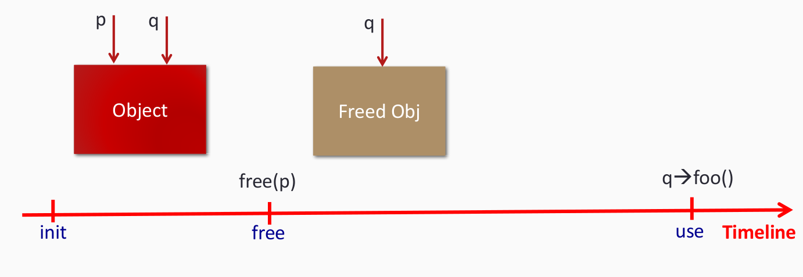

- 被释放的内存被<font color=Red>再次释放？</font>
- 被释放的内存被<font color=Red>损坏？</font>
<!-- slide data-notes="" -->
## Use-After-Free (UAF)
### 攻击
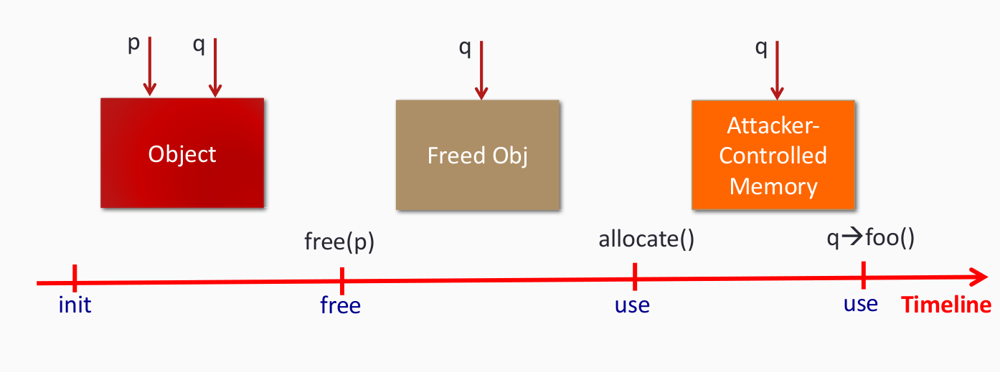
最常见的UAF攻击：<font color=Red>VTable Hijacking</font>
<!-- slide data-notes="" -->
## MS12-063 Microsoft Internet ExplorerexecCommand Vulnerability Demo

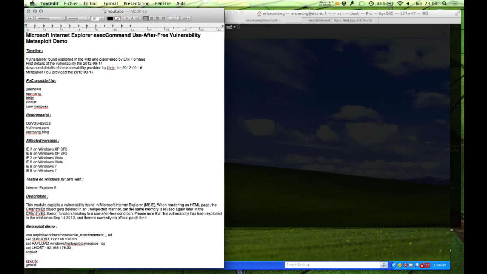
<!-- slide data-notes="" -->
## UAF vulnerability(MS12-063)
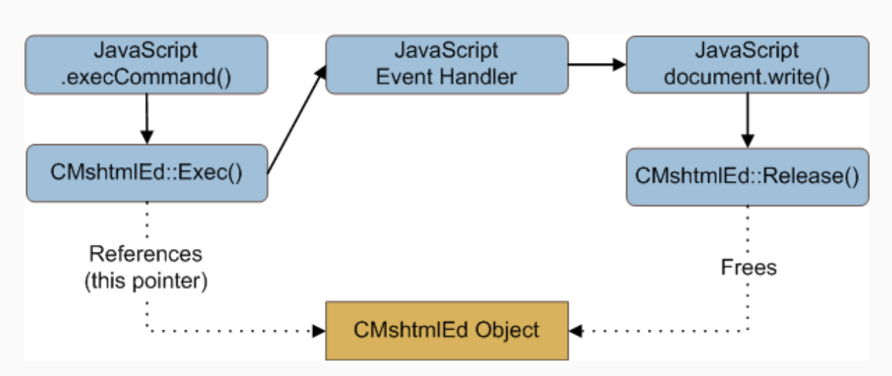

<!-- slide data-notes="" -->
## UAF vulnerability(MS12-063)
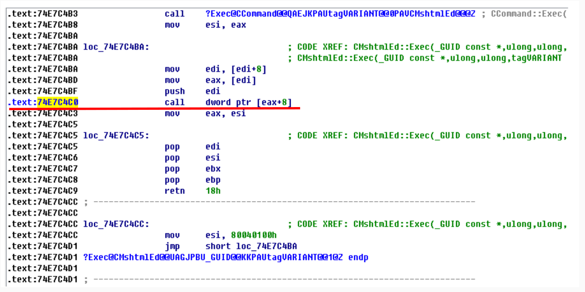

<!-- slide data-notes="" -->
## 动态分配的VTable(c++)
<div id="left">

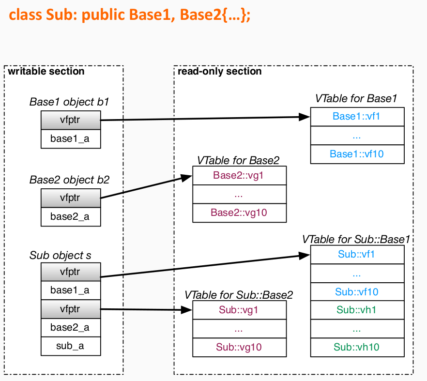

</div>

<div id="right">

```c
void foo(Base2* obj){
    obj->vg4();
}

void main(){
    Base2* obj = new Sub();
    foo(obj);
}
```
```
code section
; Function main()
push SIZE
call malloc()
mov ecx, eax
call Sub::Sub()
; now ECX points to the Sub object
add ecx, 8
; now ECX points to the Sub::Base2 object
call foo()
ret
; Function foo()
mov eax, [ecx]      ; read vfptr of Base2
mov edx, [eax+0x0C] ; get vg4() from vtable
call edx            ; call Base2::vg4()
ret
```
</div>

<!-- slide data-notes="" -->
## VTable Hijacking 分类
<div id="right">

- <font color=Red>损坏VTable</font>
    - 覆盖VTable
- VTable注入
    - 覆盖vfptr
    - 指向假的VTable
- VTable
    - 覆盖vfptr
    - 指向包括VTable，数据等。。
</div>

<div id="left">

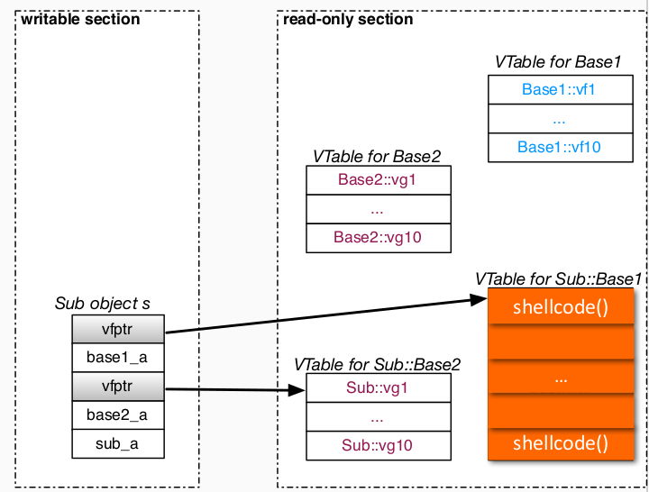

</div>

<!-- slide data-notes="" -->
## VTable Hijacking 分类
<div id="right">

- 损坏VTable
    - 覆盖VTable
- <font color=Red>VTable注入</font>
    - 覆盖vfptr
    - 指向假的VTable
- VTable
    - 覆盖vfptr
    - 指向包括VTable，数据等。。
</div>

<div id="left">

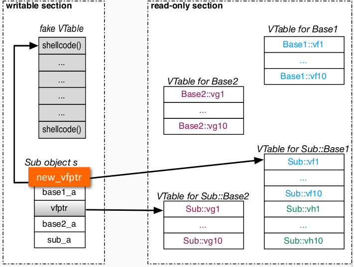

</div>

<!-- slide data-notes="" -->
## VTable Hijacking 分类
<div id="right">

- 损坏VTable
    - 覆盖VTable
- VTable注入
    - 覆盖vfptr
    - 指向假的VTable
- <font color=Red>VTable重用</font>
    - 覆盖vfptr
    - 指向包括VTable，数据等。。
</div>

<div id="left">

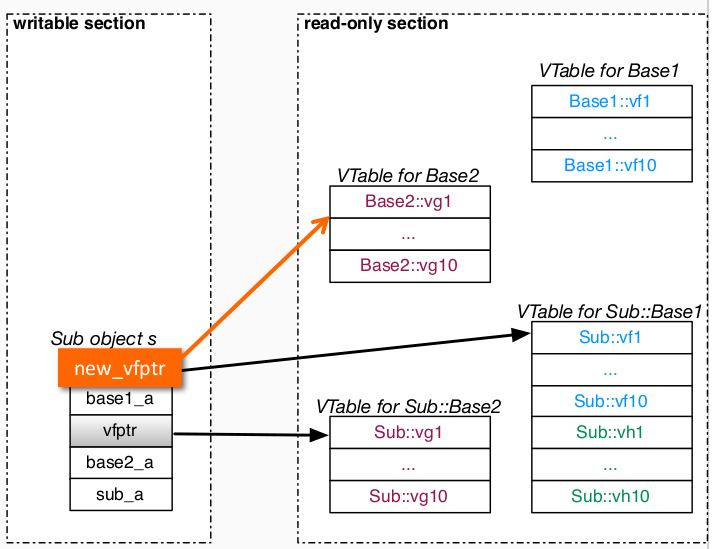

</div>

<!-- slide data-notes="" -->
## VTable Hijacking 实战

<div id="right">

- Pwn2Own 2014 firefox
- Pwn2Own 2014 chrome
- CVE-2014-1772 IE

```
code section
; Function main()
push SIZE
call malloc()
mov ecx, eax
call Sub::Sub()
; now ECX points to the Sub object
add ecx, 8
; now ECX points to the Sub::Base2 object
call foo()
ret
; Function foo()
mov eax, [ecx]      ; read vfptr of Base2
mov edx, [eax+0x0C] ; get vg4() from vtable
call edx            ; call Base2::vg4()
ret
```
</div>

<div id="left">

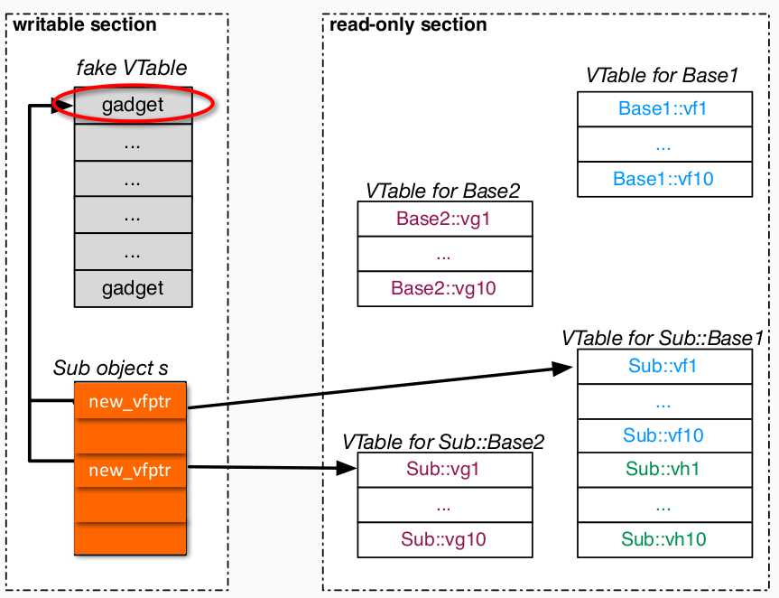

</div>

<!-- slide data-notes="" -->
## 防御VTable Hijacking
### VTint

-|Attack|Requirement|
----|----|----|----|
VTable 破坏|覆盖 VTable|VTable可写
VTable 注入|覆盖vfptr，指向被注入的VTable|VTable可写
VTable 重用|覆盖vfptr，指向包括VTable，数据|形似VTable的数据，包括VTable
<!-- slide data-notes="" -->
## VTint
-|Attack|Requirement|解决方案
----|----|----|----|
VTable 破坏|覆盖 VTable|VTable可写|VTable只读
VTable 注入|覆盖vfptr，指向被注入的VTable|VTable可写|VTable只读
VTable 重用|覆盖vfptr，指向包括VTable，数据|形似VTable的数据，包括VTable|不同的VTable/数据
<!-- slide data-notes="" -->
## VTint vs. DEP
<div id="left">

-|VTint
----|----
VTable 破坏|VTable只读
VTable 注入|VTable只读
VTable 重用|不同的VTable/数据

</div>

<div id="right">

-|DEP
----|----
VTable 破坏|只读的代码段
VTable 注入|只读的代码段(可写的段不会被执行)
VTable 重用|<font color=Red>NO</font>

</div>

- 与DEP的相同之处
    - 轻量级，可以是二进制可兼容的。
- 不同
    - 加固后，可攻击面更小

<!-- slide data-notes="" -->
## 二进制级别的防护：vfGuard
NDSS’15: Dynamic binary instrumentation
- 在运行时检查虚拟调用指令（使用PIN）
- 针对指令使用不同策略
### 优势
- 易于扩展，去执行不同策略
### 劣势
- 开销大（PIN的开销*118%）
- 无法防御VTables重用攻击
<!-- slide data-notes="" -->
## 源代码级别的防护：vfGuard
###   Microsoft IE10, Core Objects
- 在VTable结束地方的特殊cookies
### 优势
- 轻量级
### 劣势
- 只防御核心对象Core Objects
- 不能应付VTable注入
- 信息泄漏
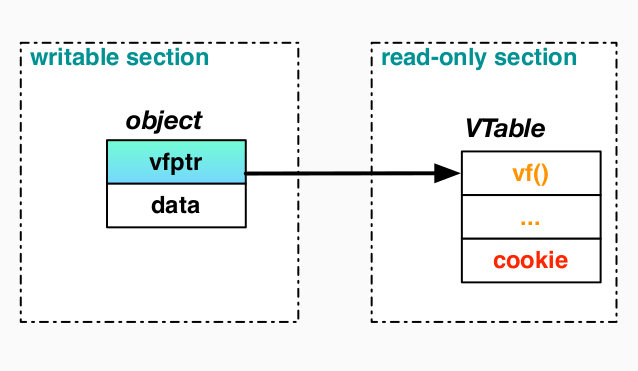
<!-- slide data-notes="" -->
## 源代码级别的防护：SafeDispatch
<div id="left">

### NDSS’14, LLVM-based
- 静态计算一系列合法目标
- 根据计算结果进行动态验证
### 策略1
#### VTable Check
劣势：
- 编译阶段需要耗费大量时间去分析
- 高运行时开销（~30%）
### 策略2
#### moethod Check
劣势：
- 编译阶段需要耗费大量时间去分析
- 高运行时开销（~7%）

</div>

<div id="right">

```c
C *x = ...
ASSERT(VPTR(x) ∈ Valid(C));
x->foo();
```
```c
C *x = ...
vptr = *((FPTR**)x);
f    = *(vptr + 0);
ASSERT(f      ∈ ValidM(C,foo));
f(x)
```
</div>

<!-- slide data-notes="" -->
## 源代码级别的防护：Forward Edge CFI
### GCC-VTV [Usenix’14], whitelist-based
```c
C *x = ...
ASSERT(VPTR(x) ∈ Valid(C));
x->foo();
```
- 在编译阶段计算一组不完整的合法目标
- 在加载是通过初始化函数合并不完整的数据
- 在运行时检验是否合法
### 优势
- 支持增量构建
### 劣势
- 运行时操作繁琐
<!-- slide data-notes="" -->
## 源代码级别的防护：RockJIT
### CCS’15, CFI-based
- 在编译阶段收集类型信息
- 根据收集到的信息计算加载时转移目标的等价类别
- 更新CFI检查，在加载时只允许间接传输到一个等价类
### 优势
- 支持增量构造
### 劣势
- 加载时开销大
<!-- slide class="middle"-->

# Thanks for watching!
