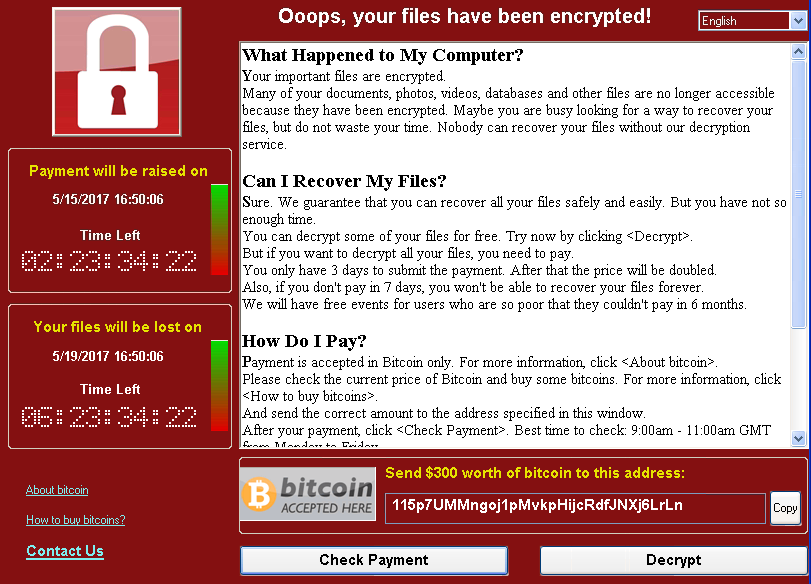
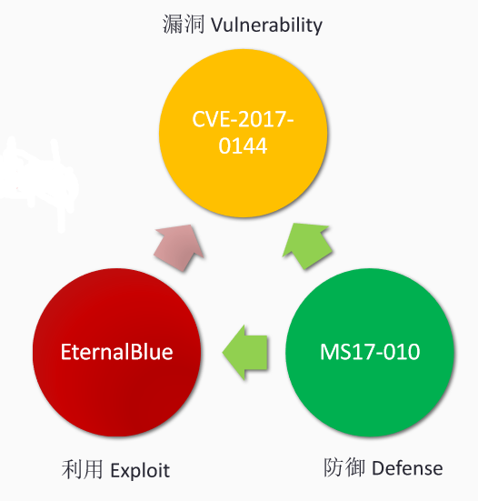
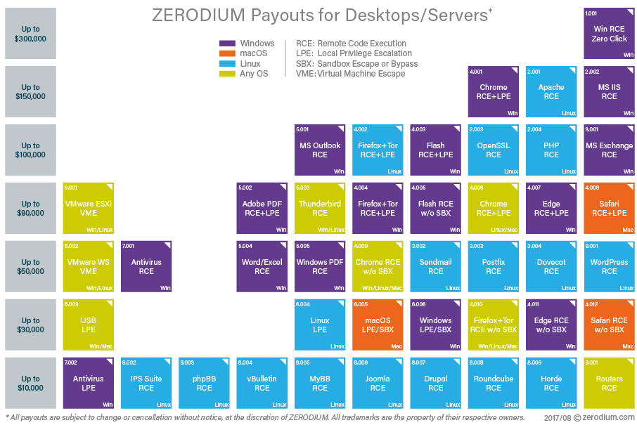
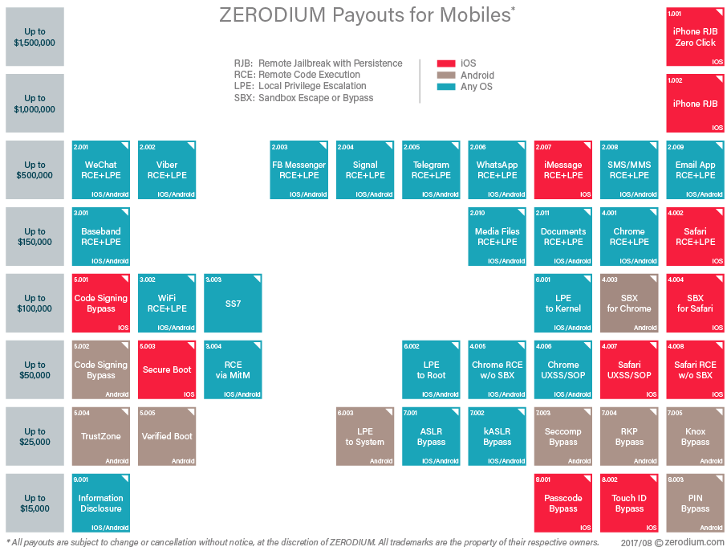

---
presentation:
  width: 1600
  height: 900
  slideNumber: 'c/t'
  showSlideNumber: "all"
  center: true
  enableSpeakerNotes: true
  theme: none.css
---

<!-- slide data-notes="" -->
# 二进制漏洞的挖掘与利用

### 课程简介

<!-- slide data-notes="" -->
## 课程目的

* 掌握常见漏洞原理

    * 理解漏洞成因
    * 培养安全编码和设计意识
    * 了解代码审计、逆向工程

* 掌握主流漏洞挖掘方法

    * 理解漏洞挖掘原理
    * 应用漏洞挖掘方案

* 掌握经典漏洞利用技术

    * 理解漏洞的危害
    * 实践漏洞利用
* 掌握经典漏洞及利用的防御

    * 理解防御原理
    * 了解防御局限性

<!-- slide data-notes="" -->
## 举个例子
### WannaCry

<!-- slide data-notes="" -->
## 举个例子
### 问题根源

<!-- slide data-notes="" -->

## 从本课程可以学到什么

* 常见漏洞（栈/堆/整数溢出/格式化字符串/UAF）
* 漏洞挖掘（逆向工程/静态分析/动态分析/符号执行/模糊测试）
* 漏洞利用（返回地址/GOT/函数指针/虚表篡改/ROP）
* 漏洞及利用防御（ASLR/DEP/CFI/Execute-only/Cookie/Shadow Stack）

<!-- slide data-notes="" -->
## 漏洞挖掘
- 栈溢出/堆溢出/格式化字符串/整数溢出/逻辑漏洞
- ~~XSS/SQL注入/CSRF/命令执行~~

| Program Name                              | Start Date     | Ending Date       | Eligible Entries                                                                                                 | Bounty range       |
|-------------------------------------------|----------------|-------------------|------------------------------------------------------------------------------------------------------------------|--------------------|
| Speculative Execution Side Channel Bounty | March 14, 2018 | December 31, 2018 | A novel category or exploit method for a Speculative Execution Side Channel vulnerability                        | Up to $250,000 USD |
| Windows Insider Preview                   | July 26, 2017  | Ongoing           | Critical and important vulnerabilities in Windows Insider Preview slow                                           | Up to $15,000 USD  |
| Windows Defender Application Guard        | July 26, 2017  | Ongoing           | Critical vulnerabilities in Windows Defender Application Guard in WIP slow                                       | Up to $30,000 USD  |
| Microsoft Hyper-V Bounty Program          | May 31, 2017   | Ongoing           | Critical remote code execution, information disclosure and denial of services vulnerabilities in Hyper-V         | Up to $250,000 USD |
| Microsoft Edge on Windows Insider Preview | August 4, 2016 | Ongoing           | Critical remote code execution and design issues in Microsoft Edge in Windows Insider Preview slow               | Up to $15,000 USD  |
| Mitigation Bypass Bounty                  | June 26, 2013  | Ongoing           | Novel exploitation techniques against protections built into the latest version of the Windows operating system. | Up to $100,000 USD |

<!-- slide class="middle" data-notes="" -->
## ZERODIUM Payouts for Desktops/Servers

<!-- slide class="middle" data-notes="" -->
## ZERODIUM Payouts for Mobiles

<!-- slide data-notes="" -->
## 漏洞利用
- 构造攻击载体（钓鱼邮件，恶意网页）
- 触发程序漏洞（缓冲区溢出等）
- 篡改程序执行状态（代码，数据）
- 绕过现有防御（微观监控，宏观控制）
- 破坏计算机系统（病毒木马、勒索、泄密等）

<!-- slide data-notes="" -->
## 漏洞挖掘
- 手工测试
- fuzzing
- 静态分析
- 动态分析

<!-- slide data-notes="" -->
## 逆向分析
不能盲目分析整个程序，主要分析在：
- 输入输出
- 数据结构：栈，堆
- 程序执行流

<!-- slide data-notes="" -->
## 关键寄存器
- 指令寄存器
- 栈基质寄存器
- 栈顶寄存器
<!-- slide data-notes="" -->

## 工具
- 静态分析：IDA pro
- 动态调试：gdb-peda，windbg
- 脚本语言：python(pwntools，zio，ROPgadget)
- 模糊测试（fuzzing）:AFL
<!-- slide data-notes="" -->
## 基础
- 计算机原理：Memory, Registers, Stack...
- 编程语言: C/C++, python
- 操作系统：Linux

<!-- slide data-notes="" -->
## 实战方向
- 物联网安全：工业控制，智能汽车，智能家居
- window office
- 浏览器安全

<!-- slide data-notes="" -->
## 合法和道德
- 有时通过学习攻击来加强防御，但是学习攻击不能 损害他人或者违反法律
- 在受控、授权的环境下攻击测试
- 技术上可行的，未必是合法的、可以做的
- 负责任的漏洞披露（有标准流程）
- 为自己的行为负责
<!-- slide data-notes="" -->
## 参考
- Book
    - Hacking: the art of exploitation
- Seed Project
    - http://www.cis.syr.edu/~wedu/seed/
- blogs：
    -  https://sploitfun.wordpress.com/2015/06/26/linux-x86exploit-development-tutorial-series/
- 训练平台：
    - https://www.root-me.org/?lang=en
    - http://pwnable.kr/

<!-- slide class="middle"-->

# Thanks for watching!
