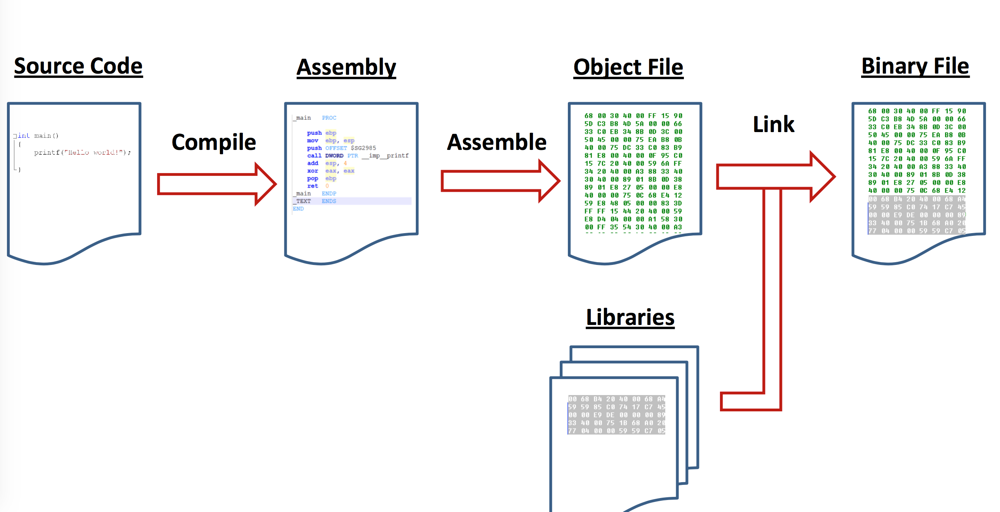
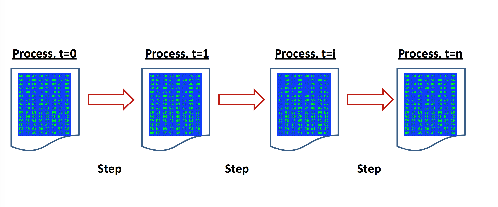
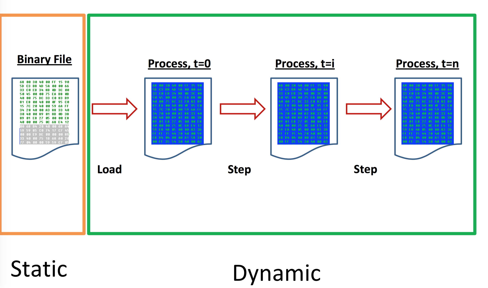
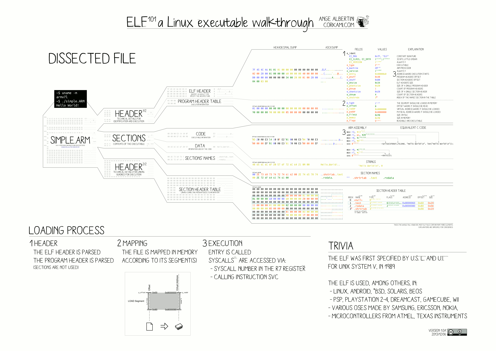
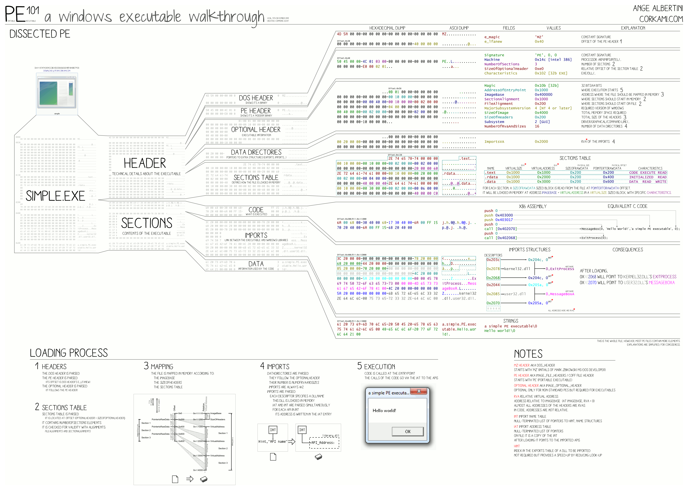
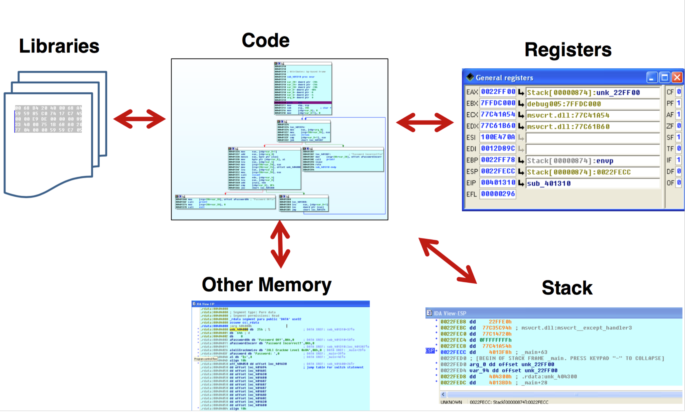

---
presentation:
  width: 1600
  height: 900
  slideNumber: 'c/t'
  showSlideNumber: "all"
  center: true
  enableSpeakerNotes: true
  theme: none.css
---

<!-- slide data-notes="" -->
# 二进制漏洞挖掘与利用
### 逆向工程基础

<!-- slide data-notes="" -->
## 编译过程
<id class="middle">


</div>

<!-- slide data-notes="" -->
## 链接过程
<id class="middle">


</div>

<!-- slide data-notes="" -->
## 运行
<id class="middle">


</div>

<!-- slide data-notes="" -->
## 逆向工程
<id class="middle">


</div>

<!-- slide data-notes="" -->
## 逆向工程之动静态
<id class="middle">


</div>

<!-- slide data-notes="" -->
## 逆向工程之静态分析 -- 工具篇
* Hex编译器
    - wxHexEditor(GUI)
    - xxd(CLI)
* ASCII可打印字符串
    - strings命令
* 文件及文件内容搜索
    - find命令
    - grep命令，文件内容搜索
    - 示例：在当前目录下查找所有包含hello world字符串的log文件，`find . -name *.log | xargs grep "hello world"`
* 可执行文件安全检查
    - checksec，参照[slimm609/checksec.sh](https://github.com/slimm609/checksec.sh)

<!-- slide data-notes="" -->
## 文件格式
* 文件类型识别
    - file命令
    - 文件magic
    - binwalk项目，参考[ReFirmLabs/binwalk](https://github.com/ReFirmLabs/binwalk)
* 文件检查
    - md5sum，校验文件md5值
    - [virustotal](https://www.virustotal.com/),识别恶意代码
    - fuzzy hashing: [ssdeep](https://github.com/ssdeep-project/ssdeep) [fuzzywuzzy](https://github.com/seatgeek/fuzzywuzzy)
    - diff/patch
* ELF/PE/Mach-O
    - readelf命令
    - peview/loard-pe/等
        - http://www.malware-analyzer.com/pe-tools

<!-- slide data-notes="" -->
## ELF文件格式
<id class="middle">


</div>

<!-- slide data-notes="" -->
## PE文件格式
<id class="middle">


</div>

<!-- slide data-notes="" -->
## 二进制文件编辑器：010 Editor
* https://www.sweetscape.com/download/010editor/
* 文件解析模板
    * PE/ELF/PDF/JPEG等
    * 还可以自行编写解析模板
* 自动化脚本
* 工具
    * 计算/比较/转换/校验

<!-- slide data-notes="" -->
## 反汇编
* objdump -d
* **IDA Pro**
    * 免费版，[点击下载](https://www.hex-rays.com/products/ida/support/download_freeware.shtml)
    * 基本模式与图形化模式切换（<kbd>Space</kbd>键）
    * 重命名变量（<kbd>n</kbd>键）
    * 注释
        * 侧方（<kbd>:</kbd>或<kbd>;</kbd>）
        * 上下（<kbd>ins</kbd>）
    * 格式转换（右键）
    * 交叉引用（<kbd>x</kbd>键）
    * 改变数据类型（数组<kbd>a</kbd>键,ASCII码<kbd>r</kbd>键）
    * 查看字符串（<kbd>shift</kbd>+<kbd>F12</kbd>）
    * IDA->Options->General->auto comment
    * Plugins (python), Loaders, Debuggers, Decompiler...

<!-- slide data-notes="" -->
## 动态调试
<id class="middle">


</div>

<!-- slide data-notes="" -->
## 动态调试
<id class="middle">


</div>

<!-- slide data-notes="" -->
## 调试器
<div id="left">

* debuggers
    - gdb
    - lldb
    - windbg
    - MSVC debugger
    - ollydbg
    - ...
* GDB commands
    - r/run, c/continue
    - s/step, n/next
    - si, ni
    - b/break
    - bt/backtrace
    - x, print, display, info
</div>

<div id="right">

```c
user@box:~/test/bof$ gdb ./test
...
(gdb) disassemble vulnerable
Dump of assembler code for function vulnerable:
0x080483f4 <vulnerable+0>: push %ebp
0x080483f5 <vulnerable+1>: mov %esp,%ebp
0x080483f7 <vulnerable+3>: sub $0x38,%esp
...
0x0804840a <vulnerable+22>: mov %eax,(%esp)
0x0804840d <vulnerable+25>: call 0x8048310 <gets@plt>
...
(gdb) break *0x0804840d
Breakpoint 1 at 0x804840d
(gdb) run < input
Starting program: /home/user/test/bof/test < input
Breakpoint 1, 0x0804840d in vulnerable ()
(gdb) x/20x $esp
0xbffff730: 0xbffff74c 0x08049630 0xbffff748 0x080482ec
...
```
</div>


<!-- slide data-notes="" -->
## GDB
* ~/.gdbinit
* gdb

```c
    - python print 'A'*10
    - help user
    - hexdump
    - r args                                  # start prog with args
    - r $(your_command_here)                  # start prog with args
    - r < filename                            # start prog, and feed input
    - r < <(your_command_here)                # start prog, and feed input
    - r > filename                            # start prog, and write output
```
* GDB customization
    - peda
    - gef

<!-- slide data-notes="" -->
## Tracing
* 库函数追踪
    * ltrace
* 系统调用追踪
    * strace

<!-- slide data-notes="" -->
## 动态二进制插桩
<div id="left">

* 背景
    * 计算机体系结构研究
        * Trace Generation
        * Branch Predictor and Cache Modeling
        * Fault Tolerance Studies
        * Emulating Speculation
        * Emulating New Instructions
    * 编译原理研究
        * 代码覆盖率
        * Call-graph生成
        * Instruction Profiling
        * 内存泄露检测
        * 污点追踪
</div>
<div id="right">

* 为何基于二进制
    * 无需重编译、重链接
    * 运行时检查
    * 附加到正在运行的进程上
* 框架介绍
    * Valgrind，[参考链接](http://valgrind.org/)
    * DynamoRIO，[参考链接](https://github.com/DynamoRIO/dynamorio)
    * Intel PIN，[参考链接](https://software.intel.com/en-us/articles/pin-a-dynamic-binary-instrumentation-tool)
</div>

<!-- slide data-notes="" -->
## Intel PIN使用
* 启动并插装一个二进制程序
    ```c
    $ pin –t pintool –- application
    pin: 插装引擎（套件所提供的命令）
    pintool: 插装工具（需自行编写，或使用现有工具）
    ```
* 附加并插装一个正在运行的程序
    ```c
    $ pin –t pintool –pid 1234
    ```

<!-- slide data-notes="" -->
## Intel PIN使用
* 基础API是架构无关的
    * 提供如下通用的功能：
        * 控制流改写
        * 内存访问
* 架构相关的API：
    * 例如IA32上的段寄存器信息
* Call-based API：
    * 定义插装的位置，例如指令前
        * 在指令首次执行时触发
    * 定义插装被激活时执行什么动作，例如增加计数器
        * 每次指令被执行时均被触发

<!-- slide data-notes="" -->
## Intel PIN使用举例
```c
#include "pin.h"
UINT64 icount = 0;
ManualExamples/inscount0.cpp

void docount() { icount++; } // analysis routine

void Instruction(INS ins, void *v) // instrumentation routine
{
INS_InsertCall(ins, IPOINT_BEFORE, (AFUNPTR)docount, IARG_END);
}

void Fini(INT32 code, void *v)
{ std::cerr << "Count " << icount << endl; }

int main(int argc, char * argv[])
{
    PIN_Init(argc, argv);
    INS_AddInstrumentFunction(Instruction, 0);
    PIN_AddFiniFunction(Fini, 0);
    PIN_StartProgram();
    return 0;
}
```
计数输出
```ruby
$ /bin/ls
Makefile imageload.out itrace proccount imageload inscount0 atrace itrace.out
$ pin -t inscount0.so -- /bin/ls
Makefile imageload.out itrace proccount imageload inscount0 atrace itrace.out
Count 422838
```


<!-- slide data-notes="" -->
## 参考资料
* IDA Pro
    * IDA_Pro_Shortcuts.pdf
    * The book on IDA
    * [IDA Syntax Highlighting](http://practicalmalwareanalysis.com/2012/03/25/decorating-your-disassembly/)
* [Corkami.com](https://github.com/corkami)
    * diagrams of file structures and other interesting trivia
* [Crackmes.de](http://crackmes.cf/)
* System background
    * [http://www.bottomupcs.com/](http://www.bottomupcs.com/)


<!-- slide class="middle"-->
# Thanks for watching!
