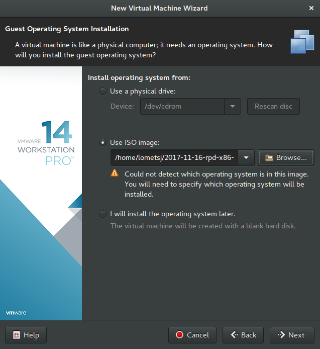

# <center>ARM溢出实验-配置实验环境</center>

## 实验概述

### 【目的】
配置用于栈溢出实验的arm环境（通过qemu）
### 【环境】
Linux
### 【工具】
qemu
### 【原理】
Qemu：是一个广泛使用的开源计算机仿真器和虚拟机
当作为仿真器时，可以在一种架构(如PC机)下运行另一种架构(如ARM)下的操作系统和程序。通过动态转化，可以获得很高的运行效率。
当 QEME 作为虚拟机时，可以使用 xen 或 kvm 访问 CPU 的扩展功能(HVM)，在主机 CPU 上直接执行虚拟客户端的代码，获得接近于真机的性能表现。
## 实验步骤

### 【步骤】
#### 交叉编译环境
```
$ sudo apt install gcc-arm-linux-gnueabi
```
使用一个hellworld尝试编译
```c
#include <stdio.h>

int main()
{
        printf("hello world\n");
        return 0;
}
```
```
$ arm-linux-gnueabi-gcc hello.c -o hello
$ file hello
hello: ELF 32-bit LSB executable, ARM, EABI5 version 1 (SYSV), dynamically linked, interpreter /lib/ld-linux.so.3, for GNU/Linux 3.2.0, BuildID[sha1]=724c886323b39b98b4e27c19aad7854d1f28ee40, not stripped
```
可以看到这里成功编译了
#### 运行环境
安装qemu-static-static
```
$ sudo apt install qemu-user-static
```
尝试直接运行
```
$ qemu-arm-static hello
/lib/ld-linux.so.3: No such file or directory
```
可以看到缺少相应的lib文件,查看帮助
```
$ qemu-arm-static -h
usage: qemu-arm [options] program [arguments...]
Linux CPU emulator (compiled for arm emulation)

Options and associated environment variables:

Argument      Env-variable      Description
-h                              print this help
-help                           
-g port       QEMU_GDB          wait gdb connection to 'port'
-L path       QEMU_LD_PREFIX    set the elf interpreter prefix to 'path'
```
发现-L可以指定路径，通过查看arm-linux-gnueabi的lib文件夹，可以发现里面有`ld-linux.so.3`，那么可以有
```
$ qemu-arm-static -L /usr/arm-linux-gnueabi/ hello
hello world
```
使用qemu-static-static有相当多的局限，更成熟的方法是使用vmware做一个arm系统虚拟机。
下载一个raspbian pi desktop的镜像
[raspbian](https://link.jianshu.com/?t=https://www.raspberrypi.org/downloads/)
下载vmware
[vmware](https://www.vmware.com/products/workstation-pro/workstation-pro-evaluation.html)
安装vmware，新建虚拟机

选择 Debian 7.x

进行后面的设置并开机,安装系统


安装成功


### 【总结】

本次实验主要配置arm的运行环境。
