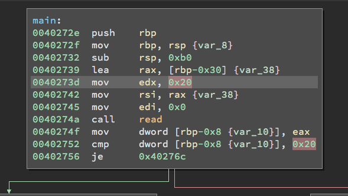

# PlaidCTF 2017 - no_mo_flo

[下载程序](./attachment/no_flo_pctf2017)

On this challenge, we're given a binary to reverse called 'no_flo'. Based on your input you get one of two results:

```c
# Failure:
You aint goin with the flow....

# Success:
Good flow!!
```

When you get the flag it will print 'Good flow!!' otherwise it will print the failure case.

The only reversing done on this was jumping into Binary Ninja for a few minutes and continuing after identifying the type of challenge.  The most important part was to find the length of the input required (0x20 or 32 bytes):


There's a perfect tool for this job that I've been meaning to use for a while now. This tool was: [https://github.com/wagiro/pintool](https://github.com/wagiro/pintool).  This is ideal if your challenge binary has a success / failure path and there's one target key to obtain.

There's an excellent article on how to use and automate Pin over on ShellStorm - http://shell-storm.org/blog/A-binary-analysis-count-me-if-you-can/

Also used CGPwn for this CTF which has been very useful, packed with things like angr, Pin, r2, pwntools, etc. (too many good things to name) - https://github.com/0xM3R/cgPwn

If this is your first time using Pin, you'll have to compile the required shared object files and include them at the top of pintool.

After everything's all setup, we can start cracking!

Running the help on pintool, we can see the available options:

```
usage: pintool.py [-h] [-e] [-l LEN] [-c NUMBER] [-b CHARACTER] [-a ARCH]
                  [-i INITPASS] [-s SIMBOL] [-d EXPRESSION]
                  Filename

positional arguments:
  Filename       Program for playing with Pin Tool

optional arguments:
  -h, --help     show this help message and exit
  -e             Study the password length, for example -e -l 40, with 40
                 characters
  -l LEN         Length of password (Default: 10 )
  -c NUMBER      Charset definition for brute force (1-Lowercase, 2-Uppecase,
                 3-Numbers, 4-Hexadecimal, 5-Punctuation, 6-All)
  -b CHARACTER   Add characters for the charset, example -b _-
  -a ARCH        Program architecture 32 or 64 bits, -b 32 or -b 64
  -i INITPASS    Inicial password characters, example -i CTF{
  -s SIMBOL      Simbol for complete all password (Default: _ )
  -d EXPRESSION  Difference between instructions that are successful or not
                 (Default: != 0, example -d '== -12', -d '=> 900', -d '<= 17'
                 or -d '!= 32')
```

Here's a simple command to start with for this binary:

```python
$ python ~/tools/pintool/pintool.py -l 32 -c 5,2,3,1 -a 64 -i 'PCTF{' -d '<= -1' ./no_flo
```

We will start to get output that looks like this:
```python
....
PCTF{nX_________________________ = 98025 difference 0 instructions
PCTF{nY_________________________ = 98025 difference 0 instructions
PCTF{nZ_________________________ = 98025 difference 0 instructions
PCTF{n0_________________________ = 98022 difference -3 instructions
PCTF{n0_________________________ = 98022 difference -3 instructions
PCTF{n0_________________________ = 98022 difference 0 instructions
PCTF{n0!________________________ = 98083 difference 61 instructions
PCTF{n0"________________________ = 98083 difference 61 instructions
PCTF{n0#________________________ = 98083 difference 61 instructions
....
```

After a while this will start to fail, I haven't figured out exactly why yet (maybe someone can answer this in the comments) -- but underscores seem to be an issue. This has happened on a couple binaries so far.

After we have reached the end of the first word, we can adjust the '`INITPASS`' attribute to include an underscore, next example command will look like this:

```python
$ python ~/tools/pintool/pintool.py -l 32 -c 5,2,3,1 -a 64 -i 'PCTF{n0_' -d '<= -1' ./no_flo
```

We continue this way until we've reached the end, and we get the flag!

```
PCTF{n0_fl0?_m0_like_ah_h3ll_n0}
```
