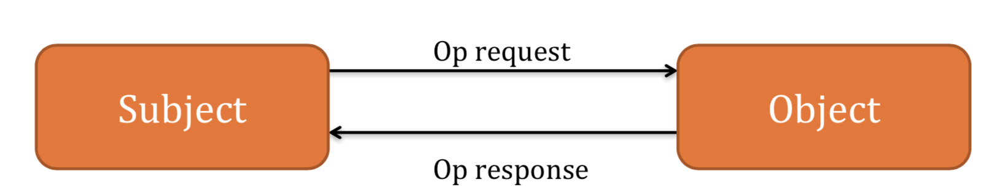
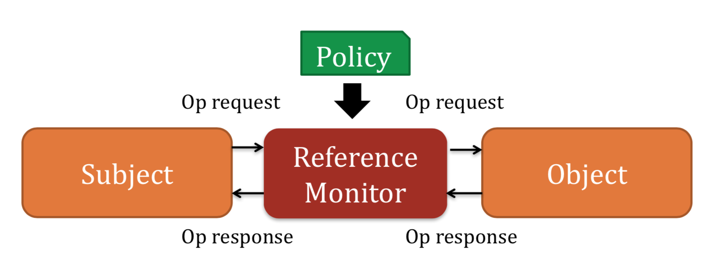

---
presentation:
  width: 1600
  height: 900
  slideNumber: 'c/t'
  showSlideNumber: "all"
  center: true
  enableSpeakerNotes: true
  theme: none.css
---

<!-- slide data-notes="" -->
# 二进制漏洞挖掘与利用
### LLVM实现Control Flow Integrity（控制流完整性）

<!-- slide data-notes="" -->
## 一个类似的例子
如果我们不能在编码的时候就做到阻止栈溢出，那么有没有一种更为通用的方法来阻止栈溢出的发生呢？

`StackGuard`:一种自动检测并能有效防护栈溢出攻击的技术。

"Programs compiled with StackGuard are safe from buffer overflow attack, regardless of the software engineering quality of the program."

事实证明这种方法简单有效。

那么对于控制流的完整性我们能不能用类似的思路来检测呢？

YES!!!

<!-- slide data-notes="" -->
## 引用监视器(Reference Monitor)
对资源的引用过程是这样的：

`Subject`:进程、计算机操作等

`Object`:文件、计算机操作、socket等

<!-- slide data-notes="" -->
## 引用监视器(Reference Monitor)
引用过程加入Monitor：

加入Monitor的三个原则：
- 所有的引用必须包含`Reference Monitor`
- `Reference Monitor`不能被未认证的`Subject`或`Object`修改
- `Reference Monitor`足够小，易于理解、测试和验证

<!-- slide data-notes="" -->
## 控制流完整性
- 强有力的保护措施：
    
    完全控制整个程序的数据内存
- 广阔的适用范围：
    
    二进制实现，语言无关
- 可证明安全：

    经形式语言证明
- 有效程度：

    实验中为0~45%，平均为16%

<!-- slide data-notes="" -->
## CFI对抗模型
- 优点
    - 随时覆盖任意数据，包括stack,heap,data segs
    - 覆盖当前上下文中的寄存器值
- 局限
    - 不能执行数据
    - 无法修改代码
    - 无法覆盖%ip
    - 无法覆盖其他上下文中的寄存器值