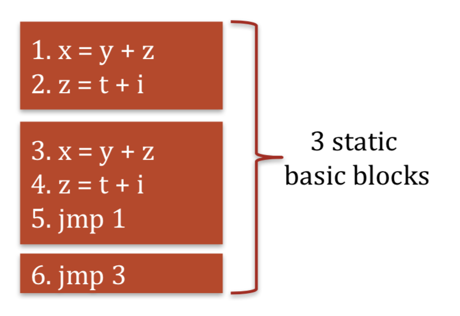
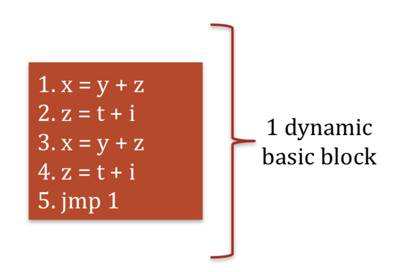
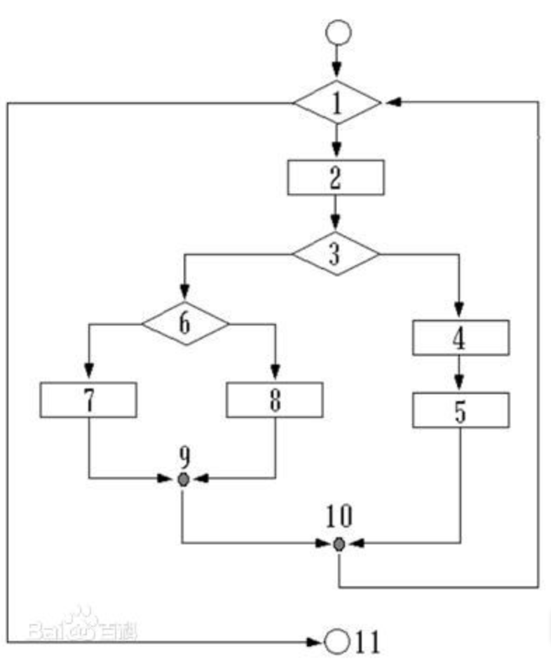
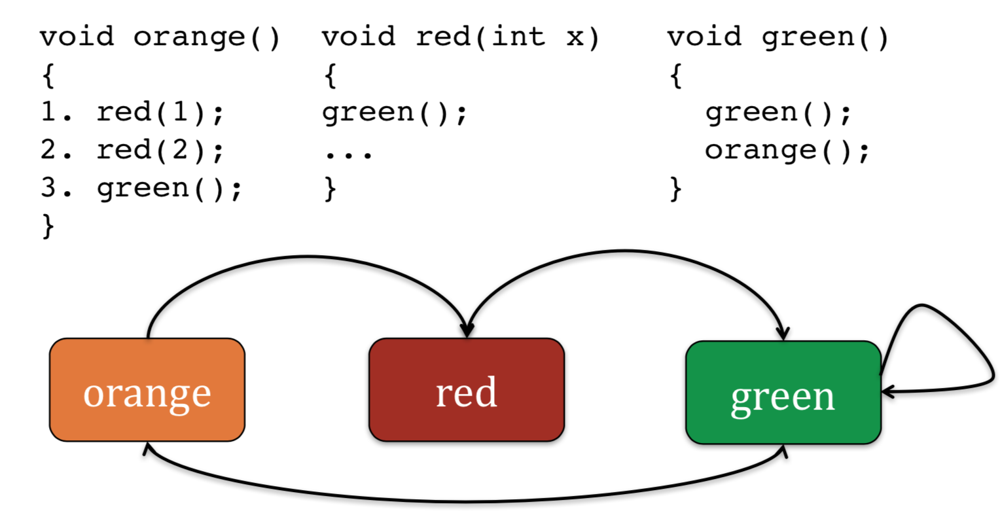
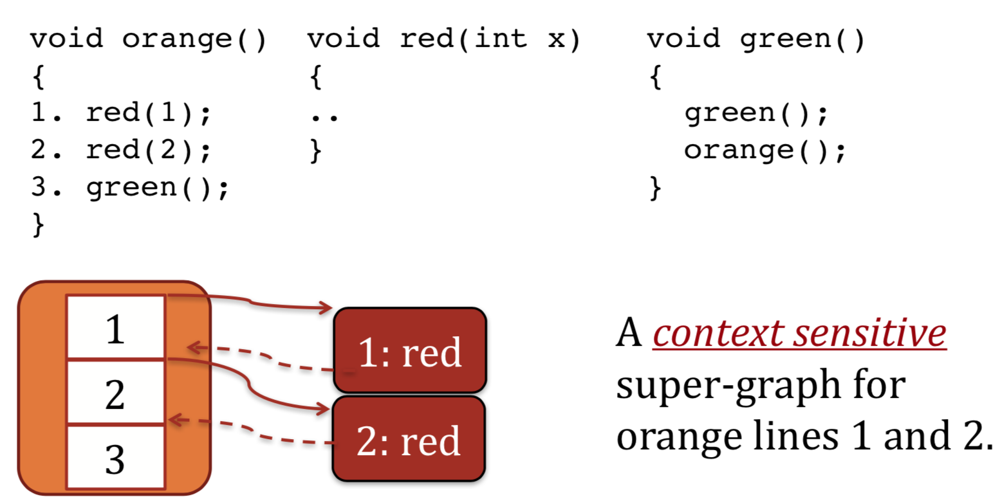

---
presentation:
  width: 1600
  height: 900
  slideNumber: 'c/t'
  showSlideNumber: "all"
  center: true
  enableSpeakerNotes: true
  theme: none.css
---

<!-- slide data-notes="" -->
# 二进制漏洞挖掘与利用
### LLVM实现Control Flow Integrity（控制流完整性）

<!-- slide data-notes="" -->
## 大纲
本节将阐述CFI及保证CFI的一些原理和方法。

- 什么是CFI
- CFI对抗模型
- 实现CFI的思想
    - 参考StackGuard
- 代码基本块的划分
- 中间代码的几种抽象数据表示
    - 控制流图(CFG)
    - 调用图(Call Graph)
    - 附加图(Superimpose Graph)
- 精确度分析

- LLVM中开启CFI支持

<!-- slide data-notes="" -->
## 控制流完整性(CFI)
- 要求
    - 不变性：程序必须严格按照运行前确定控制流图(CFG)执行。

- 原理：
    - 编译时构建静态CFG
    - 安装时指令重写
        - 添加ID和ID校验，维护ID的唯一性
    - 加载时验证CFI
        - 直接跳转，验证ID是否存在、ID是否唯一
    - 运行时校验ID
        - 间接跳转是否和分配的ID相匹配

<!-- slide data-notes="" -->
## CFI对抗模型
- 优势
    - 随时覆盖任意数据，包括stack,heap,data segs
    - 覆盖当前上下文中的寄存器值
    - 强有力的保护措施
    - 广阔的适用范围
    - 可证明安全
- 局限
    - 不能执行数据
    - 无法修改代码
    - 无法覆盖%ip
    - 无法覆盖其他上下文中的寄存器值

<!-- slide data-notes="" -->
## 一个类似的例子
如果我们不能在编码的时候就做到阻止栈溢出，那么有没有一种更为通用的方法来阻止栈溢出的发生呢？

`StackGuard`:一种自动检测并能有效防护栈溢出攻击的技术。

"Programs compiled with StackGuard are safe from buffer overflow attack, regardless of the software engineering quality of the program."

事实证明这种方法简单有效。

那么对于控制流的完整性我们能不能用类似的思路来检测呢？

YES!!!

<!-- slide data-notes="" -->
## 引用监视器(Reference Monitor)
对资源的引用过程是这样的：

`Subject`:进程、计算机操作等

`Object`:文件、计算机操作、socket等

<!-- slide data-notes="" -->
## 引用监视器(Reference Monitor)
引用过程加入Monitor：

加入Monitor的三个原则：
- 所有的引用必须包含`Reference Monitor`
- `Reference Monitor`不能被未认证的`Subject`或`Object`修改
- `Reference Monitor`足够小，易于理解、测试和验证

<!-- slide data-notes="" -->
## 基本块
基本块定义：代码序列中一组顺序执行的语句序列，只有一个入口和出口。

静态基本块：变量被赋值一次的代码块。

动态基本块：变量被多次赋值的代码块。

<!-- slide data-notes="" -->
## 基本块的入口和出口

入口语句的定义：
- 四元式的第一个语句
- 条件转移语句或无条件转移语句能转到的语句
- 紧跟在条件转移语句后面的语句

出口语句的定义：
- 下一个入口语句的前导语句
- 转移语句（包括其本身）
- 停语句（包括其本身）

<!-- slide data-notes="" -->
## 控制流图(CFG)
编译器中的一种抽象数据结构。
控制流图是这样一个图：
- 每个点都是一个基本块
- 如果控制可以从点Vi转移到点Vj，那么存在一条边(Vi,Vj)

<!-- slide data-notes="" -->
## 函数调用图(Call Graph)
用以呈现调用链。
- 图中的点为函数
- 如果函数Vi调用函数Vj，那么存在一条边(Vi,Vj)

<!-- slide data-notes="" -->
## 附加图(Superimpose CFG)
标识了控制流图中的所有过程。
